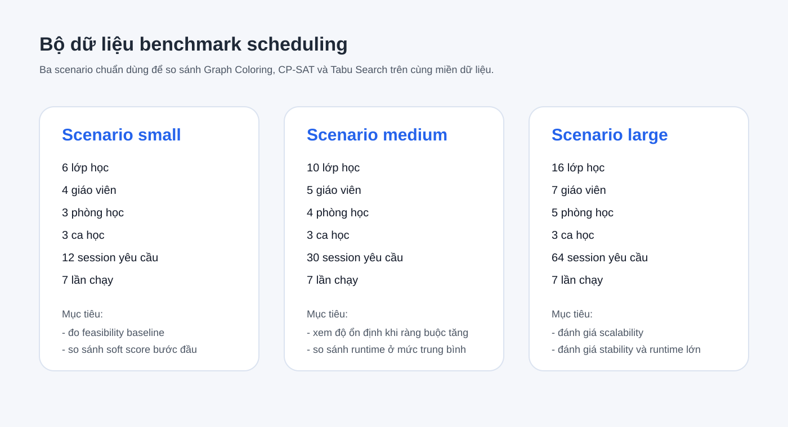
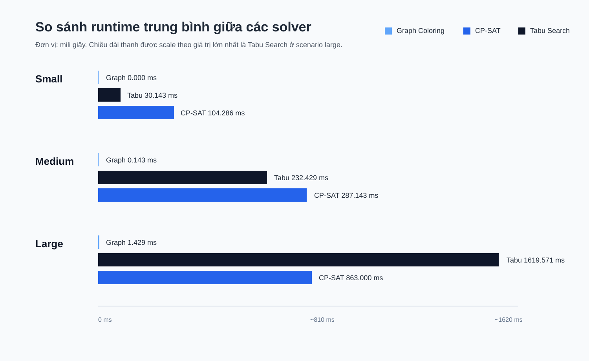
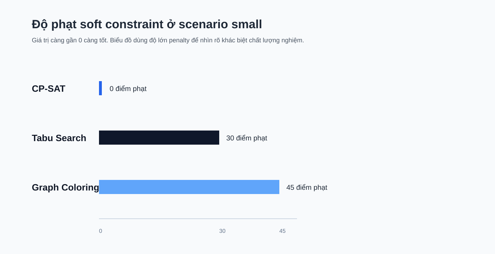
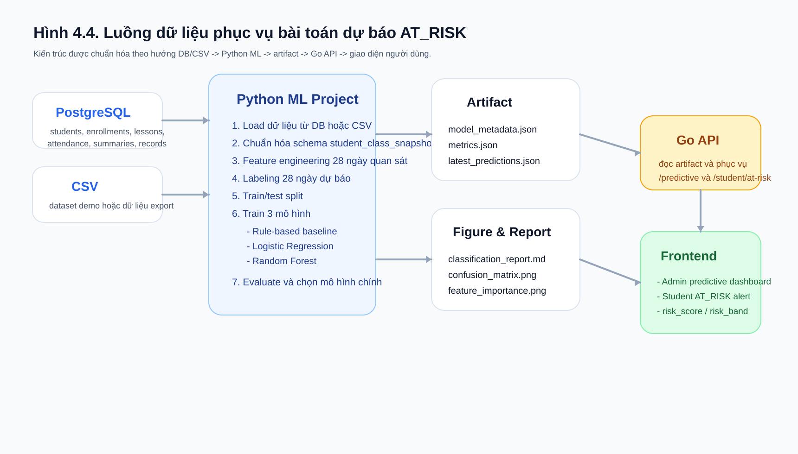
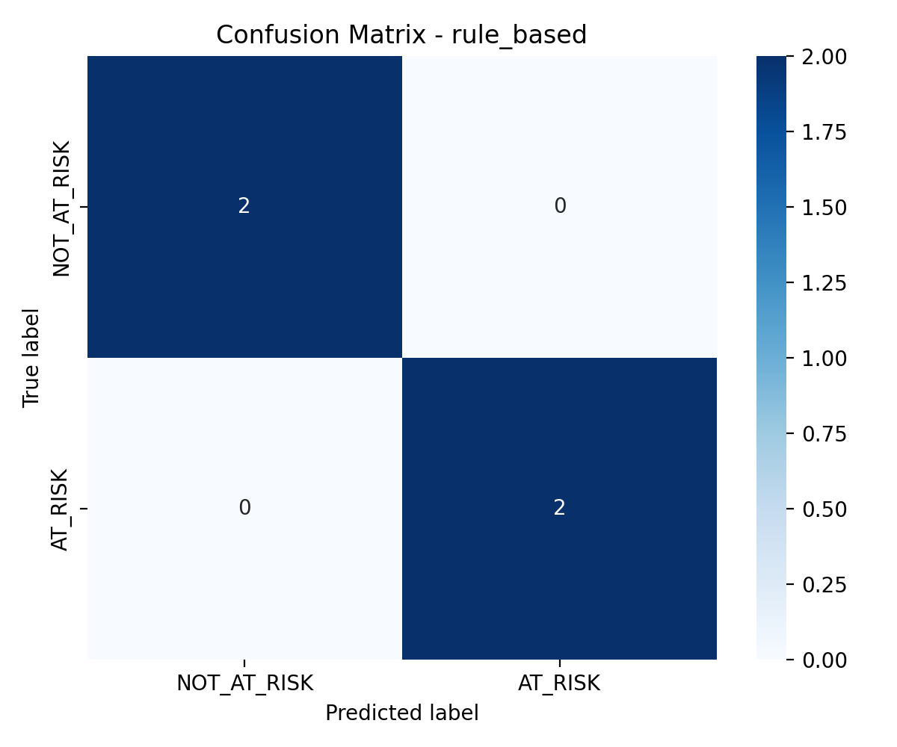
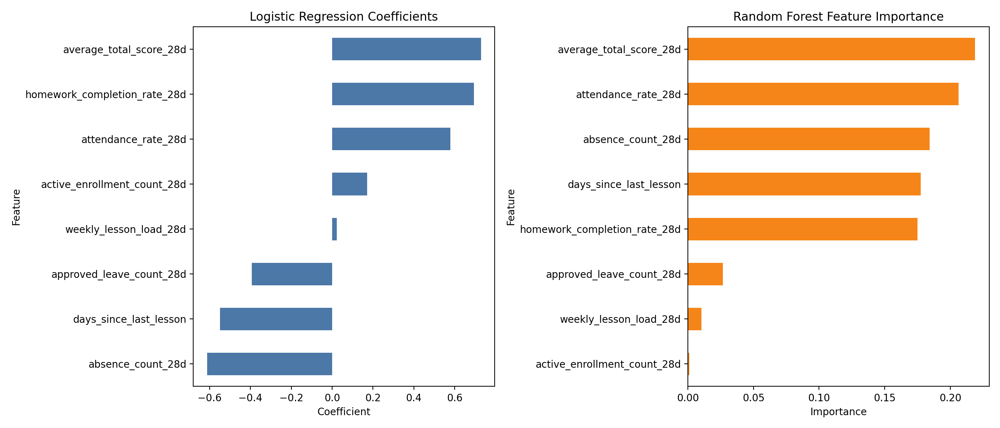

# ĐẠI HỌC XÂY DỰNG HÀ NỘI

# KHOA CÔNG NGHỆ THÔNG TIN

**ĐỒ ÁN TỐT NGHIỆP**

## Xây dựng hệ thống quản lý trung tâm dạy thêm EduCenter, trọng tâm là xếp lịch thông minh và dự báo học viên có nguy cơ học kém

**Sinh viên thực hiện:** Nguyễn Thế Hà  
**Mã số sinh viên:** 61165  
**Lớp quản lý:** CS2  
**Giảng viên hướng dẫn:** [Bổ sung GVHD]  

Hà Nội, 20/04/2026

---

# LỜI CẢM ƠN

Trong suốt quá trình học tập và thực hiện đồ án tốt nghiệp, em đã nhận được rất nhiều sự quan tâm, giúp đỡ và chỉ bảo từ thầy cô, gia đình và bạn bè. Đây là nguồn động lực rất lớn để em có thể từng bước hoàn thiện đề tài của mình.

Trước hết, em xin bày tỏ lòng biết ơn sâu sắc tới giảng viên hướng dẫn, người đã đồng hành với em trong suốt quá trình triển khai đồ án. Những góp ý, định hướng chuyên môn và sự kiên nhẫn của thầy đã giúp em nhìn nhận vấn đề bài bản hơn, biết cách bám sát mục tiêu nghiên cứu và hoàn thiện hệ thống theo hướng có chiều sâu cả về kỹ thuật lẫn nghiệp vụ.

Em cũng xin chân thành cảm ơn các thầy cô trong Khoa Công nghệ Thông tin, Trường Đại học Xây dựng Hà Nội, những người đã trang bị cho em nền tảng kiến thức trong suốt quá trình học tập. Những học phần về cơ sở dữ liệu, phân tích thiết kế hệ thống, kiến trúc phần mềm, công nghệ web và trí tuệ nhân tạo chính là cơ sở quan trọng để em thực hiện đề tài này.

Bên cạnh đó, em xin cảm ơn gia đình và bạn bè đã luôn động viên, tạo điều kiện và hỗ trợ em trong thời gian thực hiện đồ án. Sự quan tâm và khích lệ từ mọi người là chỗ dựa tinh thần quan trọng để em có thể kiên trì theo đuổi đề tài tới giai đoạn hoàn thiện.

Mặc dù đã nỗ lực rất nhiều trong quá trình triển khai, song do hạn chế về thời gian, kinh nghiệm thực tế và phạm vi của đồ án tốt nghiệp, tài liệu và hệ thống chắc chắn vẫn còn những thiếu sót nhất định. Em rất mong tiếp tục nhận được những ý kiến đóng góp quý báu từ thầy cô để có thể hoàn thiện đề tài tốt hơn.

---

# LỜI NÓI ĐẦU

Trong bối cảnh chuyển đổi số giáo dục ngày càng được quan tâm, nhu cầu xây dựng các hệ thống phần mềm hỗ trợ vận hành cho trung tâm dạy thêm trở nên thiết thực hơn bao giờ hết. Một trung tâm dạy thêm hiện đại không chỉ cần quản lý tốt học viên, giáo viên, lớp học, khóa học và chương trình đào tạo, mà còn cần có khả năng xử lý những bài toán vận hành phức tạp như xếp lịch, tối ưu nguồn lực, theo dõi kết quả học tập và hỗ trợ ra quyết định.

Xuất phát từ nhu cầu thực tiễn đó, đề tài "Xây dựng hệ thống quản lý trung tâm dạy thêm EduCenter, trọng tâm là xếp lịch thông minh và dự báo học viên có nguy cơ học kém" được lựa chọn làm nội dung thực hiện đồ án tốt nghiệp. Đề tài không chỉ hướng tới việc xây dựng một hệ thống quản lý có thể vận hành được trên thực tế, mà còn nhấn mạnh vào chiều sâu kỹ thuật ở hai bài toán có giá trị nghiên cứu cao là xếp lịch học và phân tích dữ liệu học tập.

Trong đó, bài toán xếp lịch được xem là trục kỹ thuật quan trọng nhất của hệ thống vì liên quan trực tiếp đến việc khai thác và điều phối nhiều loại tài nguyên đồng thời, bao gồm lớp học, giáo viên, phòng học, ca học và khoảng thời gian triển khai. Bên cạnh đó, hệ thống cũng xây dựng nền dữ liệu cần thiết cho hướng phát triển dự báo học viên có nguy cơ học kém, nhằm tiến tới hỗ trợ cảnh báo sớm và nâng cao chất lượng quản lý học tập trong tương lai.

Tài liệu báo cáo này được biên soạn trên cơ sở đối chiếu giữa mã nguồn hệ thống, tài liệu phân tích nghiệp vụ, tài liệu đặc tả use case, tài liệu ERD, kết quả benchmark thuật toán scheduling và các sơ đồ mô hình hóa đã được xây dựng trong quá trình phát triển project. Các hình ảnh giao diện, sơ đồ minh họa, biểu đồ benchmark và một số hình liên quan tới sequence diagram, phân rã chức năng sẽ được chèn hoàn thiện ở các vị trí đã được chuẩn bị sẵn trong tài liệu.

---

# MỤC LỤC

1. Chương 1. Giới thiệu đề tài
   1.1 Lý do chọn đề tài
   1.2 Mục tiêu đề tài
   1.3 Đối tượng và phạm vi đề tài
   1.4 Phương pháp tiếp cận và triển khai
   1.5 Công nghệ sử dụng
   1.5.1 Golang
   1.5.2 Gin Framework
   1.5.3 GORM
   1.5.4 PostgreSQL
   1.5.5 Google Wire
   1.5.6 React
   1.5.7 TypeScript
   1.5.8 MUI
   1.5.9 Redux Toolkit và RTK Query
   1.5.10 Swagger/OpenAPI
   1.5.11 PlantUML và draw.io
   1.6 Ý nghĩa khoa học và thực tiễn
   1.7 Cấu trúc của báo cáo
2. Chương 2. Phân tích hệ thống
   2.1 Tổng quan chức năng của hệ thống
   2.2 Các tác nhân và bên liên quan
   2.3 Phân rã chức năng
   2.4 Đặc tả use case của hệ thống
   2.4.1 Nhóm use case xác thực và quản lý tài khoản
   2.4.2 Nhóm use case quản lý học viên
   2.4.3 Nhóm use case quản lý giáo viên
   2.4.4 Nhóm use case quản lý khóa học
   2.4.5 Nhóm use case quản lý chương trình đào tạo
   2.4.6 Nhóm use case quản lý phòng học
   2.4.7 Nhóm use case quản lý ca học
   2.4.8 Nhóm use case quản lý lớp học và ghi danh
   2.4.9 Nhóm use case xếp lịch và lesson
   2.4.10 Nhóm use case học vụ sau lesson
   2.5 Thiết kế biểu đồ trình tự
   2.6 Mô tả các thực thể nghiệp vụ trọng tâm
   2.7 Quy tắc nghiệp vụ và ràng buộc
3. Chương 3. Thiết kế hệ thống
   3.1 Kiến trúc tổng thể hệ thống
   3.2 Quy trình nghiệp vụ và vị trí chèn sơ đồ
   3.3 Thiết kế cơ sở dữ liệu
   3.3.1 Nguyên tắc đặc tả cơ sở dữ liệu
   3.3.2 Danh mục các bảng trọng tâm
   3.3.3 Đặc tả các bảng lõi
   3.3.4 Đặc tả các bảng hỗ trợ và mở rộng
   3.3.5 Giá trị mặc định và domain dữ liệu
   3.3.6 Nhận xét về thiết kế dữ liệu hiện tại
   3.4 Thiết kế giao diện
4. Chương 4. Xếp lịch thông minh và hướng phát triển phân tích học tập
   4.1 Vai trò của bài toán scheduling
   4.2 Chuẩn hóa dữ liệu thời gian bằng Shift
   4.3 Các ràng buộc của bài toán scheduling
   4.4 Các thuật toán được cài đặt
   4.5 Bộ dữ liệu benchmark
   4.6 Kết quả benchmark
   4.7 Quyết định lựa chọn solver chính
   4.8 Hướng phát triển bài toán AT_RISK
5. Chương 5. Kết luận và hướng phát triển
   5.1 Kết quả đạt được
   5.2 Hạn chế hiện tại
   5.3 Hướng phát triển
6. Tài liệu tham khảo
7. Phụ lục

---

# DANH MỤC HÌNH ẢNH

- Hình 2.1 Sơ đồ use case tổng quan của hệ thống EduCenter
- Hình 2.2 Sơ đồ phân rã chức năng nhóm xác thực và tài khoản
- Hình 2.3 Sơ đồ phân rã chức năng nhóm quản lý đào tạo và nguồn lực
- Hình 2.4 Sơ đồ phân rã chức năng nhóm lớp học và ghi danh
- Hình 2.5 Sơ đồ phân rã chức năng nhóm scheduling và lesson
- Hình 2.6 Sơ đồ phân rã chức năng nhóm học vụ sau lesson
- Hình 2.7 Sequence diagram đăng ký tài khoản
- Hình 2.8 Sequence diagram đăng nhập
- Hình 2.9 Sequence diagram tạo học viên
- Hình 2.10 Sequence diagram tạo giáo viên
- Hình 2.11 Sequence diagram tạo lớp học
- Hình 2.12 Sequence diagram ghi danh học viên
- Hình 2.13 Sequence diagram tạo preview xếp lịch
- Hình 2.14 Sequence diagram xác nhận preview để tạo lesson
- Hình 2.15 Sequence diagram điểm danh buổi học
- Hình 2.16 Sequence diagram tạo lesson summary
- Hình 3.1 Kiến trúc tổng thể hệ thống EduCenter
- Hình 3.2 BPMN hoặc activity diagram cho luồng mở lớp đến commit lesson
- Hình 3.3 ERD logic hệ thống EduCenter
- Hình 3.4 Giao diện đăng nhập
- Hình 3.5 Giao diện quản lý học viên
- Hình 3.6 Giao diện quản lý giáo viên
- Hình 3.7 Giao diện quản lý khóa học
- Hình 3.8 Giao diện quản lý chương trình đào tạo
- Hình 3.9 Giao diện quản lý lớp học
- Hình 3.10 Giao diện scheduling preview
- Hình 3.11 Giao diện lesson detail, attendance và summary
- Hình 3.12 Giao diện predictive analytics
- Hình 4.1 Bảng benchmark ba solver
- Hình 4.2 Biểu đồ so sánh runtime giữa các solver
- Hình 4.3 Biểu đồ so sánh chất lượng nghiệm
- Hình 4.4 Luồng dữ liệu phục vụ bài toán dự báo AT_RISK

---

# DANH MỤC BẢNG BIỂU

- Bảng 1.1 Mục tiêu chức năng chính của hệ thống
- Bảng 2.1 Danh mục tác nhân của hệ thống
- Bảng 2.2 Ma trận quyền theo nhóm chức năng
- Bảng 2.3 Đặc tả use case nhóm xác thực và tài khoản
- Bảng 2.4 Đặc tả use case nhóm quản lý học viên
- Bảng 2.5 Đặc tả use case nhóm quản lý giáo viên
- Bảng 2.6 Đặc tả use case nhóm quản lý khóa học
- Bảng 2.7 Đặc tả use case nhóm quản lý chương trình đào tạo
- Bảng 2.8 Đặc tả use case nhóm quản lý phòng học
- Bảng 2.9 Đặc tả use case nhóm quản lý ca học
- Bảng 2.10 Đặc tả use case nhóm quản lý lớp học và ghi danh
- Bảng 2.11 Đặc tả use case nhóm scheduling và lesson
- Bảng 2.12 Đặc tả use case nhóm học vụ sau lesson
- Bảng 2.13 Bảng mô tả thực thể User
- Bảng 2.14 Bảng mô tả thực thể Student
- Bảng 2.15 Bảng mô tả thực thể Teacher
- Bảng 2.16 Bảng mô tả thực thể Class
- Bảng 2.17 Bảng mô tả thực thể Lesson
- Bảng 3.1 Danh mục các bảng trọng tâm của hệ thống
- Bảng 3.2 Giá trị mặc định và domain dữ liệu quan trọng
- Bảng 4.1 Bộ dữ liệu benchmark

---

# CHƯƠNG 1. GIỚI THIỆU ĐỀ TÀI

## 1.1 Lý do chọn đề tài

Hoạt động của một trung tâm dạy thêm trong thực tế bao gồm rất nhiều nghiệp vụ có liên hệ chặt chẽ với nhau như quản lý học viên, quản lý giáo viên, quản lý khóa học, chương trình đào tạo, lớp học, phòng học, ca học, lịch học, theo dõi chuyên cần, kết quả học tập và trao đổi thông tin với người học. Khi quy mô trung tâm tăng lên, việc quản lý các nghiệp vụ này bằng bảng tính hoặc thao tác thủ công dễ dẫn đến sai sót, dữ liệu rời rạc, khó truy vết và đặc biệt là khó tối ưu nguồn lực.

Trong các bài toán nghiệp vụ đó, xếp lịch là một bài toán có độ phức tạp cao và có giá trị thực tiễn rất rõ rệt. Một lịch học hợp lệ phải đồng thời thỏa mãn nhiều ràng buộc như không trùng giáo viên, không trùng phòng học, chỉ dùng các ca học còn hiệu lực, tôn trọng lịch tuần của lớp, phù hợp với thời gian triển khai và bảo đảm khả năng commit thành các buổi học thực tế. Vì vậy, bài toán này không chỉ mang ý nghĩa ứng dụng mà còn có giá trị nghiên cứu trong lĩnh vực tối ưu hóa.

Bên cạnh nhu cầu vận hành hằng ngày, các trung tâm dạy thêm hiện nay cũng cần có khả năng theo dõi tiến trình học tập của học viên một cách sát sao hơn. Nếu dữ liệu về điểm danh, tổng kết buổi học, mức độ hoàn thành bài tập và kết quả học tập được chuẩn hóa tốt, hệ thống có thể mở rộng theo hướng phân tích học tập và cảnh báo sớm học viên có nguy cơ học kém. Đây là hướng phát triển phù hợp với xu thế ứng dụng dữ liệu và trí tuệ nhân tạo trong giáo dục.

Từ những lý do trên, đề tài xây dựng hệ thống quản lý trung tâm dạy thêm EduCenter được lựa chọn nhằm giải quyết đồng thời hai mục tiêu: hỗ trợ vận hành thực tế cho trung tâm dạy thêm và tạo ra chiều sâu kỹ thuật cho đồ án tốt nghiệp thông qua bài toán xếp lịch thông minh cùng hướng phát triển phân tích học tập.

## 1.2 Mục tiêu đề tài

Mục tiêu tổng quát của đề tài là xây dựng một hệ thống quản lý trung tâm dạy thêm có cấu trúc rõ ràng, bám sát nghiệp vụ thực tế, đồng thời có điểm nhấn kỹ thuật đủ sâu để phục vụ mục tiêu nghiên cứu và bảo vệ đồ án tốt nghiệp.

Cụ thể, đề tài hướng tới các mục tiêu sau:

- Xây dựng được nền tảng quản trị cốt lõi cho trung tâm dạy thêm, bao gồm quản lý tài khoản, học viên, giáo viên, khóa học, chương trình đào tạo, phòng học, ca học và lớp học.
- Xây dựng được chuỗi nghiệp vụ vận hành lớp học từ mở lớp, ghi danh, phân công giáo viên, cấu hình lịch tuần, tạo preview xếp lịch, commit preview và sinh lesson thực tế.
- Chuẩn hóa dữ liệu thời gian bằng thực thể `Shift`, giúp toàn bộ bài toán scheduling vận hành trên các ca học chuẩn thay vì các khung giờ rời rạc.
- Cài đặt và benchmark nhiều thuật toán scheduling trên cùng một bộ dữ liệu đầu vào để đánh giá tính phù hợp trước khi chọn solver mặc định.
- Xây dựng mô hình dữ liệu phục vụ các nghiệp vụ học vụ sau lesson như điểm danh, lesson summary, academic record, leave request.
- Chuẩn bị nền dữ liệu cho hướng phát triển dự báo học viên có nguy cơ học kém theo nhãn `AT_RISK`.

**Bảng 1.1. Mục tiêu chức năng chính của hệ thống**

| STT | Nhóm mục tiêu | Nội dung |
| --- | --- | --- |
| 1 | Quản trị vận hành | Quản lý học viên, giáo viên, khóa học, chương trình, phòng học, ca học, lớp học |
| 2 | Vận hành lớp học | Ghi danh, phân công giáo viên, cấu hình lịch tuần, theo dõi roster |
| 3 | Scheduling | Tạo preview, benchmark solver, commit preview thành lesson |
| 4 | Học vụ sau lesson | Điểm danh, tổng kết buổi học, ghi nhận academic record, quản lý leave request |
| 5 | Phân tích mở rộng | Chuẩn bị dữ liệu cho bài toán dự báo học viên AT_RISK |

## 1.3 Đối tượng và phạm vi đề tài

### 1.3.1 Đối tượng hướng tới

Đối tượng mà hệ thống hướng tới là các trung tâm dạy thêm hoặc trung tâm học thêm có quy mô nhỏ đến trung bình, cần một phần mềm thống nhất để quản lý dữ liệu đào tạo, theo dõi lớp học và hỗ trợ các nghiệp vụ vận hành hằng ngày.

### 1.3.2 Phạm vi triển khai

Trong phạm vi hiện tại của đồ án, hệ thống tập trung vào các nhóm nghiệp vụ sau:

- Quản lý truy cập và danh tính: đăng ký, OTP, đăng nhập, đổi mật khẩu, đặt lại mật khẩu.
- Quản lý dữ liệu đào tạo và nguồn lực: học viên, giáo viên, khóa học, chương trình đào tạo, phòng học, ca học.
- Quản lý lớp học và ghi danh: tạo lớp, cập nhật lớp, gán giáo viên, cấu hình lịch tuần, ghi danh, rút học viên khỏi lớp.
- Xếp lịch và lesson: tạo preview xếp lịch, xem preview, benchmark solver, xác nhận preview để tạo lesson.
- Học vụ sau lesson: điểm danh, tổng kết buổi học, ghi nhận academic record, leave request.
- Hướng mở rộng dữ liệu: chuẩn bị dữ liệu cho phân tích dự báo học viên có nguy cơ học kém.

### 1.3.3 Ngoài phạm vi chính

Một số nhánh tồn tại trong codebase nhưng không được xem là trọng tâm chính thức của báo cáo ở giai đoạn hiện tại bao gồm:

- Nhánh kiểm duyệt tài liệu bằng OCR/AI ở mức hoàn chỉnh sản phẩm.
- Consultation và lead intake ở mức đầy đủ quy trình.
- Tự động hóa tác vụ nội bộ và một số công cụ dev/test.
- Triển khai production, hạ tầng DevOps hoặc đa tenant.

## 1.4 Phương pháp tiếp cận và triển khai

Thay vì xây dựng báo cáo chỉ dựa trên ý tưởng ban đầu, đề tài được triển khai theo hướng bám sát mã nguồn và đối chiếu lại với tài liệu nghiệp vụ. Cách tiếp cận này giúp nội dung báo cáo phản ánh đúng trạng thái phát triển của hệ thống.

Các bước thực hiện chính gồm:

1. Khảo sát yêu cầu nghiệp vụ của bài toán quản lý trung tâm dạy thêm.
2. Thiết kế sơ bộ miền nghiệp vụ, actor, phân rã chức năng và mô hình dữ liệu.
3. Xây dựng backend theo hướng tách lớp rõ ràng bằng mô hình Clean Architecture.
4. Cài đặt frontend cho các màn hình quản trị cốt lõi.
5. Hoàn thiện mô hình dữ liệu cho scheduling và học vụ sau lesson.
6. Nghiên cứu và benchmark nhiều solver cho bài toán scheduling.
7. Tổng hợp tài liệu phân tích, use case, ERD, sequence, benchmark để hoàn thiện báo cáo.

## 1.5 Công nghệ sử dụng

Hệ thống EduCenter được xây dựng bằng một tập hợp công nghệ full-stack nhằm bảo đảm cả ba tiêu chí: khả năng mở rộng, tính rõ ràng trong tổ chức mã nguồn và sự thuận lợi khi phát triển các chức năng quản trị.

### 1.5.1 Golang

Golang, hay Go, là ngôn ngữ lập trình được phát triển bởi Google với mục tiêu cân bằng giữa hiệu năng, độ đơn giản và khả năng bảo trì mã nguồn. Go có tốc độ biên dịch nhanh, mô hình đồng thời tốt, hệ sinh thái thư viện phong phú và cú pháp tương đối gọn. Trong đề tài này, Golang được sử dụng để xây dựng toàn bộ backend của hệ thống EduCenter. Việc lựa chọn Go giúp hệ thống đạt được hiệu năng tốt trong xử lý API, tổ chức được các lớp nghiệp vụ rõ ràng và đặc biệt phù hợp với các tác vụ scheduling cần tính toán nhiều ràng buộc trong thời gian ngắn.

### 1.5.2 Gin Framework

Gin là một web framework phổ biến trong hệ sinh thái Golang, được tối ưu cho việc xây dựng REST API với hiệu năng cao và cấu trúc middleware linh hoạt. Trong đề tài, Gin được dùng để tổ chức các endpoint API, xử lý request/response, binding dữ liệu đầu vào, middleware xác thực và phân quyền. Việc sử dụng Gin giúp backend có cấu trúc rõ ràng, dễ tách module và thuận tiện khi tích hợp Swagger để mô tả API.

### 1.5.3 GORM

GORM là một thư viện ORM phổ biến của Golang, cho phép ánh xạ giữa struct trong mã nguồn và bảng dữ liệu trong cơ sở dữ liệu quan hệ. Thay vì viết toàn bộ truy vấn SQL theo cách thủ công, GORM hỗ trợ định nghĩa entity, quan hệ khóa ngoại, ràng buộc, soft delete và nhiều thao tác CRUD phổ biến. Trong EduCenter, GORM được dùng để biểu diễn các thực thể như `User`, `Student`, `Teacher`, `Class`, `Lesson`, `Attendance` và nhiều bảng nghiệp vụ khác. Việc sử dụng GORM giúp rút ngắn thời gian phát triển, đồng thời giữ được tính nhất quán giữa tầng domain và tầng dữ liệu.

### 1.5.4 PostgreSQL

PostgreSQL là hệ quản trị cơ sở dữ liệu quan hệ mã nguồn mở mạnh mẽ, nổi bật ở khả năng tuân thủ chuẩn SQL, hỗ trợ kiểu dữ liệu phong phú và hiệu năng tốt trong các hệ thống nghiệp vụ. Trong đề tài, PostgreSQL được dùng làm cơ sở dữ liệu trung tâm cho toàn bộ hệ thống. PostgreSQL phù hợp với EduCenter vì hỗ trợ tốt UUID, kiểu mảng, kiểu JSONB, transaction và các quan hệ giữa bảng. Đây là lựa chọn phù hợp cho những hệ thống quản lý dữ liệu có nhiều thực thể liên kết chặt chẽ như trung tâm dạy thêm.

### 1.5.5 Google Wire

Google Wire là công cụ hỗ trợ dependency injection theo hướng biên dịch mã nguồn. Thay vì khởi tạo thủ công quá nhiều dependency trong ứng dụng, Wire cho phép định nghĩa quan hệ phụ thuộc giữa repository, service, use case và controller một cách rõ ràng hơn. Trong EduCenter, Wire hỗ trợ việc lắp ghép các thành phần của hệ thống theo mô hình Clean Architecture, giúp mã nguồn dễ bảo trì và hạn chế tình trạng phụ thuộc chéo giữa các module.

### 1.5.6 React

React là thư viện JavaScript nổi tiếng để xây dựng giao diện người dùng theo hướng component-based. Với React, giao diện được chia thành các thành phần nhỏ, có khả năng tái sử dụng cao và dễ quản lý trạng thái hiển thị. Trong đề tài, React được sử dụng để xây dựng giao diện quản trị cho các màn hình quản lý học viên, giáo viên, khóa học, lớp học, scheduling và một số màn hình phục vụ lesson. Việc sử dụng React giúp giao diện linh hoạt, hiện đại và phù hợp với mô hình SPA.

### 1.5.7 TypeScript

TypeScript là phần mở rộng của JavaScript có bổ sung hệ thống kiểu tĩnh. Khi phát triển các dự án frontend quy mô vừa hoặc lớn, TypeScript giúp giảm lỗi do sai kiểu dữ liệu, tăng khả năng tự mô tả của mã nguồn và hỗ trợ tốt hơn khi làm việc với API. Trong hệ thống EduCenter, TypeScript được dùng cùng React để bảo đảm dữ liệu trao đổi giữa frontend và backend có cấu trúc rõ ràng, đặc biệt hữu ích khi xử lý các DTO phức tạp như scheduling preview, lesson detail hoặc academic record.

### 1.5.8 MUI

MUI là một thư viện giao diện người dùng cho React, cung cấp nhiều component sẵn có như bảng dữ liệu, form, dialog, button, card, tabs và các thành phần quản lý layout. Trong EduCenter, MUI giúp chuẩn hóa giao diện quản trị, rút ngắn thời gian xây dựng các màn hình CRUD và giữ được tính nhất quán về thẩm mỹ cũng như trải nghiệm người dùng giữa các module.

### 1.5.9 Redux Toolkit và RTK Query

Redux Toolkit là bộ công cụ hiện đại giúp quản lý state trong ứng dụng React theo cách đơn giản và an toàn hơn so với Redux truyền thống. RTK Query là phần mở rộng tập trung vào việc gọi API, cache dữ liệu và đồng bộ state giữa frontend và backend. Trong EduCenter, Redux Toolkit và RTK Query hỗ trợ lưu trữ trạng thái đăng nhập, gọi API danh sách dữ liệu, đồng bộ các thao tác CRUD và giảm số lượng logic lặp lại ở frontend.

### 1.5.10 Swagger/OpenAPI

Swagger là tập hợp công cụ dựa trên chuẩn OpenAPI dùng để mô tả, tài liệu hóa và kiểm thử API. Trong hệ thống EduCenter, Swagger giúp đội phát triển dễ kiểm tra endpoint, đối chiếu input/output của API và phục vụ quá trình phát triển frontend song song với backend. Ngoài ra, Swagger còn giúp báo cáo có cơ sở rõ ràng khi mô tả các chức năng đã được triển khai thật trong hệ thống.

### 1.5.11 PlantUML và draw.io

PlantUML và draw.io là hai công cụ quan trọng dùng trong quá trình mô hình hóa hệ thống. PlantUML thuận tiện cho việc quản lý sơ đồ dưới dạng mã nguồn, trong khi draw.io cho phép xây dựng các sơ đồ trực quan như use case diagram, BPMN-level activity diagram và ERD logic. Trong đề tài, hai công cụ này được sử dụng để chuẩn bị các sơ đồ phục vụ phân tích và thiết kế hệ thống, đồng thời tạo ra các hình minh họa sẽ được chèn vào báo cáo hoàn chỉnh.

## 1.6 Ý nghĩa khoa học và thực tiễn

Về mặt thực tiễn, đề tài góp phần số hóa các nghiệp vụ quan trọng của một trung tâm dạy thêm, giúp giảm thao tác thủ công, tăng khả năng truy vết dữ liệu và nâng cao hiệu quả vận hành. Về mặt học thuật, đề tài tạo ra giá trị ở việc mô hình hóa bài toán scheduling, tách lớp solver theo hướng mở rộng, benchmark nhiều thuật toán trên cùng một tập ràng buộc và chuẩn bị dữ liệu cho một bài toán phân tích học tập có thể mở rộng thành machine learning.

## 1.7 Cấu trúc của báo cáo

Báo cáo được tổ chức thành năm chương chính. Chương 1 trình bày bối cảnh, mục tiêu và công nghệ sử dụng. Chương 2 tập trung vào phân tích hệ thống, actor, use case, phân rã chức năng và mô tả thực thể nghiệp vụ. Chương 3 trình bày thiết kế hệ thống, kiến trúc, quy trình nghiệp vụ, thiết kế cơ sở dữ liệu và giao diện. Chương 4 là phần nhấn mạnh kỹ thuật về scheduling và hướng phát triển dữ liệu phân tích học tập. Chương 5 tổng kết những kết quả đạt được, các hạn chế và định hướng mở rộng.

---

# CHƯƠNG 2. PHÂN TÍCH HỆ THỐNG

## 2.1 Tổng quan chức năng của hệ thống

EduCenter là hệ thống quản lý trung tâm dạy thêm được xây dựng nhằm hỗ trợ đồng thời hai lớp bài toán: lớp bài toán quản trị vận hành và lớp bài toán tối ưu hóa/suy luận trên dữ liệu. Dưới góc độ nghiệp vụ, hệ thống có thể được nhìn nhận như một chuỗi xử lý khép kín bắt đầu từ quản lý danh mục, đi qua tổ chức lớp học, scheduling và kết thúc ở việc theo dõi dữ liệu học tập sau lesson.

Các chức năng chính của hệ thống bao gồm:

- Xác thực và quản lý tài khoản người dùng.
- Quản lý học viên, giáo viên, khóa học, chương trình đào tạo.
- Quản lý phòng học, ca học, lớp học và lịch tuần của lớp.
- Ghi danh học viên và phân công giáo viên.
- Tạo preview xếp lịch, benchmark thuật toán và commit preview thành lesson.
- Theo dõi lesson, điểm danh, tổng kết buổi học, kết quả học tập và leave request.
- Chuẩn bị dữ liệu cho nhánh dự báo học viên có nguy cơ học kém.

## 2.2 Các tác nhân và bên liên quan

**Bảng 2.1. Danh mục tác nhân của hệ thống**

| Tác nhân | Vai trò chính | Mục tiêu |
| --- | --- | --- |
| Guest | người dùng chưa đăng nhập | đăng ký tài khoản, đăng nhập, quên mật khẩu |
| Admin | quản trị viên hoặc giáo vụ | quản lý toàn bộ dữ liệu cốt lõi, mở lớp, scheduling, benchmark |
| Teacher | giáo viên | xem lesson, điểm danh, viết summary, ghi nhận kết quả học tập, upload tài liệu |
| Student | học viên | xem thông tin học tập, xem kết quả, gửi đơn xin phép |
| Reviewer / Compliance | người duyệt tài liệu | xem tài liệu bị gắn cờ, duyệt hoặc từ chối |
| SMTP Service | hệ thống gửi mail | gửi OTP và mail hỗ trợ reset password |
| Scheduling Engine | hệ thống xử lý scheduling | sinh preview, kiểm tra xung đột, commit lesson |
| OCR / AI Moderation | hệ thống kiểm duyệt nội dung | trích xuất OCR, gắn nhãn tài liệu |

**Bảng 2.2. Ma trận quyền theo nhóm chức năng**

| Nhóm chức năng | Guest | Admin | Teacher | Student | Reviewer | System |
| --- | --- | --- | --- | --- | --- | --- |
| Đăng ký, đăng nhập, quên mật khẩu | Có | Có | Có | Có | Có | Hỗ trợ |
| Quản lý học viên | Không | Có | Dấu vết quyền rộng ở code, nhưng không phải quyền nghiệp vụ mong muốn | Không | Không | Không |
| Quản lý giáo viên | Không | Có | Không | Không | Không | Không |
| Quản lý khóa học, chương trình | Không | Có | Không | Không | Không | Không |
| Quản lý phòng học, ca học | Không | Có | Không | Không | Không | Không |
| Quản lý lớp học và ghi danh | Không | Có | Không | Không | Không | Không |
| Scheduling và benchmark | Không | Có | Không | Không | Không | Thực thi solver |
| Điểm danh, lesson summary, academic record | Không | Có thể xem hoặc can thiệp ở một số flow | Có | Không | Không | Không |
| Leave request | Không | Duyệt | Có thể xem theo lớp ở một số flow | Tạo | Không | Không |
| Upload và duyệt tài liệu | Không | Có thể duyệt | Upload | Không | Duyệt | OCR/AI |

## 2.3 Phân rã chức năng

Về mặt chức năng, hệ thống có thể được phân rã thành sáu nhánh lớn:

1. Quản lý truy cập và danh tính.
2. Quản lý danh mục đào tạo và nguồn lực.
3. Quản lý lớp học và ghi danh.
4. Xếp lịch và lesson.
5. Hoạt động học tập sau buổi học.
6. Quản lý tài liệu giảng dạy và các nhánh mở rộng.

**[Chèn Hình 2.1: Sơ đồ use case tổng quan của hệ thống EduCenter]**

**[Chèn Hình 2.2: Sơ đồ phân rã chức năng nhóm xác thực và tài khoản]**

**[Chèn Hình 2.3: Sơ đồ phân rã chức năng nhóm quản lý đào tạo và nguồn lực]**

**[Chèn Hình 2.4: Sơ đồ phân rã chức năng nhóm lớp học và ghi danh]**

**[Chèn Hình 2.5: Sơ đồ phân rã chức năng nhóm scheduling và lesson]**

**[Chèn Hình 2.6: Sơ đồ phân rã chức năng nhóm học vụ sau lesson]**

## 2.4 Đặc tả use case của hệ thống

### 2.4.1 Nhóm use case xác thực và quản lý tài khoản

**Bảng 2.3. Đặc tả use case nhóm xác thực và quản lý tài khoản**

| UseCase ID | Tên use case | Tác nhân | Tiền điều kiện | Hậu điều kiện | Mô tả ngắn |
| --- | --- | --- | --- | --- | --- |
| UC-AUTH-01 | Đăng ký tài khoản | Guest | người dùng chưa có tài khoản hợp lệ | tạo user mới, sinh OTP xác minh | người dùng nhập thông tin đăng ký để tạo tài khoản ban đầu |
| UC-AUTH-02 | Xác minh email OTP | User | đã có OTP hợp lệ chưa hết hạn | tài khoản được kích hoạt | người dùng nhập OTP để xác nhận email |
| UC-AUTH-03 | Đăng nhập | Guest hoặc user chưa có session | tài khoản tồn tại và đủ điều kiện đăng nhập | hệ thống trả access token và refresh token | người dùng đăng nhập vào hệ thống |
| UC-AUTH-04 | Refresh token | user đã có refresh token hợp lệ | refresh token còn hiệu lực | hệ thống cấp access token mới | gia hạn phiên đăng nhập |
| UC-AUTH-05 | Quên mật khẩu | Guest hoặc user | email tồn tại trong hệ thống | sinh token reset password | người dùng yêu cầu đặt lại mật khẩu |
| UC-AUTH-06 | Đặt lại mật khẩu | user có token reset hợp lệ | token chưa dùng và chưa hết hạn | mật khẩu mới được cập nhật | hoàn tất quá trình reset password |
| UC-AUTH-07 | Đổi mật khẩu | user đã đăng nhập | biết mật khẩu cũ | lưu mật khẩu mới | đổi mật khẩu khi đang có session |
| UC-AUTH-08 | Xem hồ sơ cá nhân | user đã đăng nhập | token hợp lệ | hiển thị thông tin hồ sơ hiện tại | lấy thông tin người dùng đang thao tác |

**Luồng cơ bản nhóm xác thực**

- Đăng ký tài khoản:
  1. Người dùng truy cập màn hình đăng ký.
  2. Người dùng nhập họ tên, email và mật khẩu.
  3. Hệ thống kiểm tra định dạng dữ liệu và tính duy nhất của email.
  4. Hệ thống tạo mới bản ghi `User`, lưu mật khẩu dưới dạng băm.
  5. Hệ thống sinh OTP, tạo bản ghi `UserOTP` và gửi email xác minh.
  6. Hệ thống phản hồi rằng tài khoản đã được tạo ở trạng thái chờ xác minh.
- Xác minh OTP:
  1. Người dùng nhập OTP nhận qua email.
  2. Hệ thống kiểm tra OTP, thời hạn sử dụng và trạng thái đã dùng/chưa dùng.
  3. Nếu hợp lệ, hệ thống đánh dấu OTP đã dùng và kích hoạt tài khoản.
- Đăng nhập:
  1. Người dùng nhập email và mật khẩu.
  2. Hệ thống kiểm tra thông tin đăng nhập.
  3. Nếu hợp lệ, hệ thống tạo token đăng nhập và trả về thông tin phiên làm việc.

**Luồng ngoại lệ chính**

- Email đã tồn tại khi đăng ký.
- OTP không đúng, đã hết hạn hoặc đã sử dụng.
- Tài khoản chưa active nhưng cố đăng nhập.
- Token reset password không hợp lệ hoặc đã hết hạn.

### 2.4.2 Nhóm use case quản lý học viên

**Bảng 2.4. Đặc tả use case nhóm quản lý học viên**

| UseCase ID | Tên use case | Tác nhân | Trigger | Tiền điều kiện | Hậu điều kiện |
| --- | --- | --- | --- | --- | --- |
| UC-STU-01 | Tạo học viên | Admin | muốn thêm hồ sơ học viên mới | đã đăng nhập | tạo bản ghi `Student` mới |
| UC-STU-02 | Tìm kiếm / xem danh sách học viên | Admin | muốn xem hoặc lọc học viên | đã đăng nhập | trả danh sách học viên theo bộ lọc |
| UC-STU-03 | Cập nhật học viên | Admin | muốn chỉnh sửa hồ sơ học viên | học viên tồn tại | cập nhật hồ sơ học viên |
| UC-STU-04 | Xóa học viên | Admin | muốn loại học viên khỏi hệ thống | học viên tồn tại | xóa mềm hồ sơ học viên |

**Luồng cơ bản**

- Tạo học viên:
  1. Admin truy cập màn hình quản lý học viên.
  2. Admin chọn chức năng thêm mới.
  3. Admin nhập các thông tin như mã học viên, họ tên, email, số điện thoại, số điện thoại phụ huynh, khối lớp, ngày sinh, giới tính, địa chỉ.
  4. Hệ thống kiểm tra dữ liệu đầu vào.
  5. Hệ thống tạo bản ghi `Student`, gán trạng thái mặc định `ACTIVE` nếu chưa truyền vào.
  6. Hệ thống trả kết quả thành công và hiển thị lại danh sách.
- Xem danh sách học viên:
  1. Admin truy cập màn hình danh sách.
  2. Admin nhập điều kiện tìm kiếm hoặc bộ lọc.
  3. Hệ thống trả dữ liệu phân trang theo điều kiện.
- Cập nhật học viên:
  1. Admin mở chi tiết học viên.
  2. Admin sửa thông tin cần thiết.
  3. Hệ thống cập nhật dữ liệu theo ID.
- Xóa học viên:
  1. Admin chọn chức năng xóa.
  2. Hệ thống yêu cầu xác nhận.
  3. Sau khi xác nhận, hệ thống thực hiện xóa mềm.

**Lưu ý nghiệp vụ**

- Theo thiết kế nghiệp vụ, nhóm use case này thuộc quyền Admin.
- Tuy nhiên, code hiện tại còn tồn tại khoảng trống phân quyền ở một số route student CRUD. Đây là điểm cần nêu trong báo cáo như một rủi ro kỹ thuật.

### 2.4.3 Nhóm use case quản lý giáo viên

**Bảng 2.5. Đặc tả use case nhóm quản lý giáo viên**

| UseCase ID | Tên use case | Tác nhân | Tiền điều kiện | Hậu điều kiện | Ghi chú |
| --- | --- | --- | --- | --- | --- |
| UC-TCH-01 | Tạo giáo viên | Admin | đã đăng nhập | tạo mới `Teacher` | `employment_type` mặc định `PART_TIME`, `status` mặc định `ACTIVE` |
| UC-TCH-02 | Xem lịch dạy giáo viên | Admin, Teacher | giáo viên tồn tại | hiển thị lesson theo giáo viên | dựa trên dữ liệu lesson |
| UC-TCH-03 | Xem thống kê giờ dạy | Admin, Teacher | giáo viên tồn tại | trả tổng số giờ đã dạy | tổng hợp từ lesson |
| UC-TCH-04 | Cập nhật giáo viên | Admin | giáo viên tồn tại | cập nhật hồ sơ giáo viên | suy luận từ CRUD hiện có |
| UC-TCH-05 | Xóa giáo viên | Admin | giáo viên tồn tại | xóa mềm giáo viên | suy luận từ CRUD hiện có |

**Luồng cơ bản tiêu biểu**

- Tạo giáo viên:
  1. Admin truy cập chức năng quản lý giáo viên.
  2. Admin nhập mã, họ tên, email, số điện thoại, trường công tác, hình thức làm việc, ghi chú.
  3. Hệ thống kiểm tra dữ liệu.
  4. Nếu chưa truyền trạng thái hoặc hình thức làm việc, hệ thống gán giá trị mặc định.
  5. Hệ thống lưu dữ liệu.
- Xem lịch dạy:
  1. Người dùng chọn giáo viên cần xem.
  2. Hệ thống đọc lesson gắn với giáo viên đó.
  3. Hệ thống hiển thị lịch dạy theo thời gian.

### 2.4.4 Nhóm use case quản lý khóa học

**Bảng 2.6. Đặc tả use case nhóm quản lý khóa học**

| UseCase ID | Tên use case | Tác nhân | Tiền điều kiện | Hậu điều kiện | Ghi chú |
| --- | --- | --- | --- | --- | --- |
| UC-CRS-01 | Tạo khóa học | Admin | đã đăng nhập | tạo mới `Course` | `status` mặc định `ACTIVE` |
| UC-CRS-02 | Cập nhật khóa học | Admin | khóa học tồn tại | cập nhật `Course` | có route update rõ trong hệ thống |
| UC-CRS-03 | Xem danh sách khóa học | Admin | đã đăng nhập | trả danh sách khóa học | suy luận từ module CRUD hiện có |
| UC-CRS-04 | Xóa khóa học | Admin | khóa học tồn tại | xóa mềm khóa học | suy luận từ CRUD hiện có |

**Luồng cơ bản**

- Admin thêm mới khóa học bằng cách nhập mã khóa học, tên khóa học, mô tả, khối lớp, môn học, số buổi, thời lượng mỗi buổi, tổng số giờ, học phí và trạng thái.
- Hệ thống dùng dữ liệu này làm nền để tạo chương trình đào tạo, mở lớp và tính toán scheduling.

### 2.4.5 Nhóm use case quản lý chương trình đào tạo

**Bảng 2.7. Đặc tả use case nhóm quản lý chương trình đào tạo**

| UseCase ID | Tên use case | Tác nhân | Tiền điều kiện | Hậu điều kiện | Ghi chú |
| --- | --- | --- | --- | --- | --- |
| UC-PRG-01 | Tạo chương trình | Admin | đã đăng nhập | tạo mới `Program` | dùng mã, tên, track, hiệu lực |
| UC-PRG-02 | Gán khóa học vào chương trình | Admin | chương trình và khóa học tồn tại | tạo mapping `ProgramCourse` | quan hệ nhiều-nhiều |
| UC-PRG-03 | Cập nhật / xuất bản / lưu trữ chương trình | Admin | chương trình tồn tại | cập nhật thông tin hoặc lifecycle | lifecycle chưa hoàn chỉnh tuyệt đối |
| UC-PRG-04 | Xóa chương trình | Admin | chương trình tồn tại | xóa mềm hoặc lưu trữ | cần làm rõ theo nghiệp vụ |

**Điểm nghiệp vụ cần nhấn mạnh**

- Chương trình đào tạo là thực thể có vai trò gom nhóm khóa học.
- Trong code hiện tại, `Program` không còn dùng `status` như migration cũ mà chuyển sang mô hình có `published_at` và `archived_at`.
- Đây là một điểm quan trọng cần nêu trong phần nhận xét về độ hoàn thiện nghiệp vụ.

### 2.4.6 Nhóm use case quản lý phòng học

**Bảng 2.8. Đặc tả use case nhóm quản lý phòng học**

| UseCase ID | Tên use case | Tác nhân | Tiền điều kiện | Hậu điều kiện |
| --- | --- | --- | --- | --- |
| UC-ROM-01 | Tạo phòng học | Admin | đã đăng nhập | tạo mới `Room` |
| UC-ROM-02 | Xem danh sách phòng học | Admin | đã đăng nhập | trả danh sách phòng |
| UC-ROM-03 | Cập nhật phòng học | Admin | phòng tồn tại | cập nhật `Room` |
| UC-ROM-04 | Xóa phòng học | Admin | phòng tồn tại | xóa hoặc vô hiệu hóa phòng |

**Luồng cơ bản**

- Admin nhập mã phòng, tên phòng, sức chứa và địa chỉ.
- Hệ thống lưu thông tin và dùng dữ liệu này trong các module mở lớp, class schedule và scheduling.

### 2.4.7 Nhóm use case quản lý ca học

**Bảng 2.9. Đặc tả use case nhóm quản lý ca học**

| UseCase ID | Tên use case | Tác nhân | Tiền điều kiện | Hậu điều kiện |
| --- | --- | --- | --- | --- |
| UC-SHF-01 | Tạo ca học | Admin | đã đăng nhập | tạo mới `Shift` |
| UC-SHF-02 | Xem danh sách ca học | Admin | đã đăng nhập | trả danh sách ca học |
| UC-SHF-03 | Cập nhật ca học | Admin | ca học tồn tại | cập nhật `Shift` |
| UC-SHF-04 | Xóa hoặc vô hiệu hóa ca học | Admin | ca học tồn tại | thay đổi trạng thái dùng cho scheduling |

**Quy tắc nghiệp vụ**

- Chỉ các `Shift` đang ở trạng thái `is_active = true` mới được dùng cho scheduling.
- `session_type` là trường chuẩn hóa quan trọng với các giá trị điển hình như `MORNING`, `AFTERNOON`, `EVENING`, `CUSTOM`.

### 2.4.8 Nhóm use case quản lý lớp học và ghi danh

**Bảng 2.10. Đặc tả use case nhóm quản lý lớp học và ghi danh**

| UseCase ID | Tên use case | Tác nhân | Tiền điều kiện | Hậu điều kiện | Ghi chú |
| --- | --- | --- | --- | --- | --- |
| UC-CLS-01 | Tạo lớp học | Admin | đã có dữ liệu nền cần thiết | tạo mới `Class` | mặc định `status = OPEN` nếu không truyền |
| UC-CLS-02 | Cập nhật lớp học | Admin | lớp tồn tại | cập nhật `Class` | hỗ trợ sửa nhiều thuộc tính của lớp |
| UC-CLS-03 | Phân công giáo viên cho lớp | Admin | lớp và giáo viên tồn tại | cập nhật `teacher_id` cho lớp | chưa kiểm workload ở bước gán |
| UC-SCHCFG-01 | Cấu hình lịch tuần cho lớp | Admin | lớp và shift tồn tại | tạo dữ liệu `ClassSchedule` | hiện thiếu API quản trị rõ ràng |
| UC-ENR-01 | Ghi danh học viên vào lớp | Admin | lớp và học viên tồn tại | tạo `Enrollment` | code hiện set `ENROLLED` trực tiếp |
| UC-ENR-02 | Rút học viên khỏi lớp | Admin | enrollment tồn tại | xóa roster hoặc cập nhật trạng thái | hiện có use case remove |

**Luồng nghiệp vụ tiêu biểu**

- Tạo lớp học:
  1. Admin nhập mã lớp, tên lớp, ngày bắt đầu, sĩ số, học phí và thông tin liên kết như chương trình, khóa học, giáo viên, phòng học.
  2. Hệ thống tạo `Class` với trạng thái mặc định `OPEN`.
- Ghi danh học viên:
  1. Admin chọn lớp học cần thao tác.
  2. Admin chọn danh sách học viên.
  3. Hệ thống tạo mới bản ghi `Enrollment`.
  4. Theo ý đồ entity, enrollment có default `APPLIED`; tuy nhiên code hiện tại lưu `ENROLLED` trực tiếp.
- Cấu hình lịch tuần:
  1. Admin chọn lớp.
  2. Admin chọn thứ trong tuần và `Shift`.
  3. Hệ thống tạo `ClassSchedule`.

### 2.4.9 Nhóm use case xếp lịch và lesson

**Bảng 2.11. Đặc tả use case nhóm scheduling và lesson**

| UseCase ID | Tên use case | Tác nhân | Tiền điều kiện | Hậu điều kiện | Ghi chú |
| --- | --- | --- | --- | --- | --- |
| UC-SOL-01 | Tạo preview xếp lịch | Admin | có lớp `OPEN`, shift active và room khả dụng | sinh `PreviewResult` | không lưu thành bảng DB chính thức |
| UC-SOL-02 | Xem preview xếp lịch | Admin | preview tồn tại | hiển thị assignments, conflicts, summary | có latest preview và preview theo run_id |
| UC-SOL-03 | Benchmark solver | Admin | có input benchmark hợp lệ | trả kết quả benchmark | dùng để so sánh nhiều solver |
| UC-SOL-04 | Xác nhận preview để tạo lesson | Admin | preview ở trạng thái `COMPLETED`, không có hard conflict | sinh `Lesson` thực tế | đầu ra là dữ liệu lesson chính thức |
| UC-LSN-01 | Xem danh sách lesson | Admin, Teacher | lesson đã được tạo | hiển thị lesson theo actor | module lesson management còn đang phát triển tiếp |

**Luồng cơ bản tạo preview**

1. Admin chọn khoảng ngày và bộ lọc nếu có.
2. Hệ thống tải các lớp `OPEN`, teacher, room, shift active và class schedule.
3. Hệ thống chuyển dữ liệu sang input của solver.
4. Solver sinh assignments, conflicts và summary.
5. Hệ thống trả kết quả preview để người dùng xem xét.

**Luồng cơ bản commit preview**

1. Admin chọn preview cần xác nhận.
2. Hệ thống kiểm tra trạng thái preview.
3. Nếu preview hợp lệ, hệ thống sinh các bản ghi `Lesson`.
4. Hệ thống trả về kết quả commit với danh sách lesson đã tạo.

### 2.4.10 Nhóm use case học vụ sau lesson

**Bảng 2.12. Đặc tả use case nhóm học vụ sau lesson**

| UseCase ID | Tên use case | Tác nhân | Tiền điều kiện | Hậu điều kiện | Ghi chú |
| --- | --- | --- | --- | --- | --- |
| UC-ATD-01 | Điểm danh | Teacher | lesson tồn tại và thuộc quyền giáo viên | tạo/cập nhật `Attendance` | domain status cần chuẩn hóa thêm |
| UC-SUM-01 | Tạo tổng kết buổi học | Teacher | lesson tồn tại | tạo/cập nhật `LessonSummary` | mỗi lesson tối đa một summary |
| UC-ACR-01 | Ghi nhận academic record | Teacher | lesson summary tồn tại | tạo/cập nhật `AcademicRecord` | quy tắc tính tổng điểm chưa khóa chặt |
| UC-LVE-01 | Tạo đơn xin phép | Student | student có lesson hoặc class liên quan | tạo `LeaveRequest` | trạng thái mặc định `PENDING` |
| UC-LVE-02 | Duyệt / từ chối đơn xin phép | Admin, Teacher theo flow hiện có | leave request tồn tại và đang `PENDING` | cập nhật trạng thái sang `APPROVED` hoặc `REJECTED` | hiện đã có logic update status ở use case |

**Luồng cơ bản**

- Điểm danh:
  1. Giáo viên mở lesson được phân công.
  2. Hệ thống tải roster học viên từ enrollment.
  3. Giáo viên nhập trạng thái điểm danh.
  4. Hệ thống lưu `Attendance`.
- Tạo lesson summary:
  1. Giáo viên mở lesson.
  2. Giáo viên nhập chủ đề, nội dung, bài tập, nhận xét lớp.
  3. Hệ thống lưu `LessonSummary`.
- Ghi nhận academic record:
  1. Giáo viên chọn từng học viên trong lesson.
  2. Giáo viên nhập mức độ hoàn thành bài tập, điểm thành phần và nhận xét cá nhân.
  3. Hệ thống lưu `AcademicRecord`.
- Tạo đơn xin phép:
  1. Học viên tạo đơn theo loại `LEAVE`, `LATE` hoặc `EARLY`.
  2. Hệ thống lưu đơn ở trạng thái `PENDING`.

## 2.5 Thiết kế biểu đồ trình tự

Từ góc độ báo cáo tốt nghiệp, nhóm sequence diagram nên được chèn theo từng cụm use case trọng yếu. Dưới đây là các vị trí đã được chuẩn bị sẵn để người thực hiện chỉ cần bổ sung hình hoàn thiện sau này.

**[Chèn Hình 2.7: Sequence diagram đăng ký tài khoản]**

**[Chèn Hình 2.8: Sequence diagram đăng nhập]**

**[Chèn Hình 2.9: Sequence diagram tạo học viên]**

**[Chèn Hình 2.10: Sequence diagram tạo giáo viên]**

**[Chèn Hình 2.11: Sequence diagram tạo lớp học]**

**[Chèn Hình 2.12: Sequence diagram ghi danh học viên vào lớp]**

**[Chèn Hình 2.13: Sequence diagram tạo preview xếp lịch]**

**[Chèn Hình 2.14: Sequence diagram xác nhận preview để tạo lesson]**

**[Chèn Hình 2.15: Sequence diagram điểm danh buổi học]**

**[Chèn Hình 2.16: Sequence diagram tạo lesson summary]**

Khi bổ sung hình, nên ưu tiên các luồng thể hiện rõ lớp giao diện, controller, use case, repository và database để làm nổi bật kiến trúc của hệ thống.

## 2.6 Mô tả các thực thể nghiệp vụ trọng tâm

Phần này được xây dựng theo tinh thần của khung mẫu: không chỉ nêu tên bảng hoặc tên lớp, mà còn diễn giải vai trò nghiệp vụ, trường dữ liệu quan trọng và ý nghĩa của từng thực thể trong hệ thống.

**Bảng 2.13. Bảng mô tả thực thể User**

| Trường / thành phần | Kiểu dữ liệu | Ý nghĩa |
| --- | --- | --- |
| `id` | UUID | định danh duy nhất của tài khoản |
| `code` | string | mã nội bộ người dùng |
| `full_name` | string | họ tên hiển thị |
| `email` | string | email đăng nhập chính |
| `password` | string | mật khẩu đã băm |
| `role` | string | vai trò hệ thống |
| `is_active` | bool | trạng thái kích hoạt tài khoản |
| `created_at`, `updated_at`, `deleted_at` | timestamp | thông tin audit |

`User` là thực thể nền cho toàn bộ hệ thống xác thực. Mọi luồng liên quan tới đăng ký, đăng nhập, OTP, reset password hay phân quyền đều xoay quanh thực thể này.

**Bảng 2.14. Bảng mô tả thực thể Student**

| Trường / thành phần | Kiểu dữ liệu | Ý nghĩa |
| --- | --- | --- |
| `id`, `code` | UUID, string | mã định danh học viên |
| `full_name` | string | tên học viên |
| `email`, `phone` | string | thông tin liên hệ học viên |
| `guardian_phone` | string | liên hệ phụ huynh |
| `grade_level` | string | khối lớp |
| `status` | string | trạng thái học viên |
| `date_of_birth`, `gender`, `address` | timestamp, string, string | hồ sơ cá nhân |

`Student` là thực thể trung tâm của miền quản lý người học. Thực thể này liên kết tới `Enrollment`, `Attendance`, `AcademicRecord` và `LeaveRequest`, vì vậy có vai trò xuyên suốt trong cả vận hành lớp học lẫn phân tích học tập.

**Bảng 2.15. Bảng mô tả thực thể Teacher**

| Trường / thành phần | Kiểu dữ liệu | Ý nghĩa |
| --- | --- | --- |
| `id`, `code` | UUID, string | định danh giáo viên |
| `full_name`, `email`, `phone` | string | hồ sơ giáo viên |
| `is_school_teacher` | bool | phân biệt giáo viên trường phổ thông hay cộng tác viên |
| `school_name` | string | trường công tác |
| `employment_type` | string | hình thức làm việc |
| `status` | string | trạng thái hoạt động |
| `notes` | string | ghi chú bổ sung |

`Teacher` vừa là nguồn lực đầu vào của scheduling, vừa là actor chính của chuỗi học vụ sau lesson như điểm danh, lesson summary và academic record.

**Bảng 2.16. Bảng mô tả thực thể Class**

| Trường / thành phần | Kiểu dữ liệu | Ý nghĩa |
| --- | --- | --- |
| `id`, `code`, `name` | UUID, string, string | định danh và tên lớp |
| `start_date`, `end_date` | timestamp | thời gian vận hành lớp |
| `max_students` | int | sĩ số tối đa |
| `status` | string | trạng thái lớp |
| `program_id`, `course_id`, `teacher_id`, `room_id` | UUID | liên kết các dữ liệu nền |
| `price` | numeric | học phí lớp |

`Class` là thực thể trung tâm của vận hành học vụ. Tất cả các use case như ghi danh, cấu hình lịch tuần, scheduling và tạo lesson đều dựa trên lớp học.

**Bảng 2.17. Bảng mô tả thực thể Lesson**

| Trường / thành phần | Kiểu dữ liệu | Ý nghĩa |
| --- | --- | --- |
| `id` | UUID | định danh buổi học |
| `class_id` | UUID | lesson thuộc lớp nào |
| `teacher_id` | UUID | giáo viên phụ trách lesson |
| `room_id` | UUID | phòng học của lesson |
| `date_start`, `date_end` | timestamp | thời gian bắt đầu và kết thúc |
| `notes` | text | ghi chú buổi học |

`Lesson` là kết quả đầu ra của quá trình commit preview scheduling. Khi lesson đã được tạo, đây sẽ là hạt nhân để hệ thống tiếp tục xử lý điểm danh, lesson summary, academic record và các nghiệp vụ học tập sau buổi học.

## 2.7 Quy tắc nghiệp vụ và ràng buộc

Một số quy tắc nghiệp vụ quan trọng của hệ thống bao gồm:

- Mã `code` của các thực thể chính phải là duy nhất.
- Chỉ các lớp ở trạng thái `OPEN` mới được đưa vào scheduling.
- Chỉ các ca học còn active mới được dùng để sinh slot.
- `ClassSchedule` phải tham chiếu tới `Shift` hợp lệ và dùng cặp `day_of_week + shift_id`.
- `Enrollment` phản ánh roster lớp học; hiện có dấu vết approval flow nhưng code đang tạo `ENROLLED` trực tiếp.
- Preview chỉ được commit khi ở trạng thái `COMPLETED` và không có hard conflict.
- `LessonSummary` có quan hệ một-một với lesson.
- `LeaveRequest` chỉ nên được xử lý khi còn ở trạng thái `PENDING`.
- `Attendance.status` hiện dùng kiểu số nguyên và cần được chuẩn hóa rõ ràng hơn giữa tầng nội bộ và giao diện giáo viên.

---

# CHƯƠNG 3. THIẾT KẾ HỆ THỐNG

## 3.1 Kiến trúc tổng thể hệ thống

Hệ thống EduCenter được xây dựng theo hướng tách lớp rõ ràng giữa frontend, backend, tầng use case và tầng dữ liệu. Về tổng thể, hệ thống gồm bốn khối chính:

- Khối giao diện người dùng ở frontend React + TypeScript.
- Khối API backend Golang + Gin.
- Khối xử lý nghiệp vụ theo hướng Clean Architecture.
- Khối lưu trữ dữ liệu PostgreSQL.

Từ góc nhìn triển khai, frontend có nhiệm vụ hiển thị giao diện, thu thập dữ liệu đầu vào và gọi API. Backend chịu trách nhiệm xác thực, kiểm tra dữ liệu, điều phối use case, làm việc với repository và truy xuất dữ liệu từ PostgreSQL. Riêng module scheduling được tổ chức qua abstraction `SchedulingSolver`, cho phép thay thế hoặc benchmark nhiều solver trên cùng một miền dữ liệu.

**[Chèn Hình 3.1: Kiến trúc tổng thể hệ thống EduCenter]**

## 3.2 Quy trình nghiệp vụ và vị trí chèn sơ đồ

Quy trình nghiệp vụ cốt lõi của hệ thống có thể mô tả theo chuỗi sau:

1. Admin tạo các dữ liệu nền như học viên, giáo viên, khóa học, chương trình đào tạo, phòng học và ca học.
2. Admin mở lớp học, gán chương trình hoặc khóa học, phân công giáo viên và khai báo lịch tuần.
3. Admin ghi danh học viên vào lớp.
4. Hệ thống sử dụng thông tin lớp, shift, phòng và giáo viên để tạo preview xếp lịch.
5. Admin xem preview, đánh giá xung đột và xác nhận.
6. Hệ thống commit preview và sinh lesson thực tế.
7. Giáo viên sử dụng lesson để điểm danh, viết summary và ghi nhận kết quả học tập.
8. Học viên có thể gửi leave request; quản trị viên hoặc giáo viên xử lý theo flow được cho phép.

**[Chèn Hình 3.2: BPMN hoặc activity diagram cho luồng mở lớp đến commit lesson]**

Nếu cần mở rộng phần sơ đồ ở chương này, nên ưu tiên:

- BPMN hoặc activity diagram cho luồng mở lớp, ghi danh, phân công giáo viên, cấu hình lịch tuần, preview, commit.
- Sequence diagram cho luồng scheduling.
- Sequence diagram cho luồng học vụ sau lesson.

## 3.3 Thiết kế cơ sở dữ liệu

### 3.3.1 Nguyên tắc đặc tả cơ sở dữ liệu

Phần đặc tả dữ liệu trong báo cáo này được tổng hợp từ ba nguồn chính của hệ thống: `entities` trong backend Golang, các file migration PostgreSQL và các use case đang vận hành thực tế. Cách làm này giúp phần mô tả cơ sở dữ liệu bám sát trạng thái code hiện tại thay vì chỉ mô tả ở mức ý tưởng.

Một số quy ước thiết kế dữ liệu đang được dùng thống nhất trong EduCenter:

- Khóa chính của hầu hết các bảng sử dụng UUID.
- Cơ sở dữ liệu mục tiêu là PostgreSQL.
- Các bảng giao dịch quan trọng dùng `created_at`, `updated_at` để truy vết thay đổi.
- Một số bảng dùng `deleted_at` để xóa mềm nhằm bảo toàn lịch sử.
- Các trường trạng thái đang được cài theo kiểu chuỗi hoặc số nguyên; một số domain đã chốt rõ trong code, một số vẫn cần chuẩn hóa thêm ở bước hoàn thiện sản phẩm.

### 3.3.2 Danh mục các bảng trọng tâm

**Bảng 3.1. Danh mục các bảng trọng tâm của hệ thống**

| Nhóm dữ liệu | Bảng | Vai trò |
| --- | --- | --- |
| Tài khoản và bảo mật | `users`, `user_otps`, `password_resets` | quản lý đăng nhập, kích hoạt tài khoản, quên mật khẩu |
| Danh mục đào tạo | `students`, `teachers`, `courses`, `programs`, `program_courses` | quản lý học viên, giáo viên, khóa học và chương trình |
| Tài nguyên vận hành | `rooms`, `shifts` | chuẩn hóa phòng học và ca học |
| Tổ chức lớp | `classes`, `class_schedules`, `enrollments` | mở lớp, lịch tuần, roster học viên |
| Vận hành buổi học | `lessons`, `attendances`, `lesson_summaries`, `academic_records`, `leave_requests` | quản lý lesson sau scheduling và học vụ sau lesson |
| Hỗ trợ mở rộng | `consultations`, `materials`, `audit_logs`, `approval_decisions`, `labels`, `objectives`, `outcomes` | tư vấn tuyển sinh, kiểm duyệt tài liệu, mục tiêu học tập |

**[Chèn Hình 3.3: ERD logic hệ thống EduCenter]**

### 3.3.3 Đặc tả các bảng lõi

#### a. Bảng `users`

| Trường | Kiểu dữ liệu | Ràng buộc | Ý nghĩa |
| --- | --- | --- | --- |
| `id` | UUID | PK, default `uuid_generate_v4()` | mã định danh tài khoản |
| `code` | varchar(50) | unique | mã nội bộ người dùng |
| `full_name` | varchar(255) |  | họ tên hiển thị |
| `email` | varchar(255) | not null, unique | email đăng nhập chính |
| `password` | text | not null | mật khẩu đã băm |
| `role` | varchar(50) | default `STUDENT` | vai trò hệ thống |
| `is_active` | boolean | default `true` ở entity | cờ kích hoạt tài khoản |
| `created_at`, `updated_at` | timestamp | audit | thời gian tạo/cập nhật |
| `deleted_at` | timestamp | soft delete | phục vụ xóa mềm |

#### b. Bảng `user_otps`

| Trường | Kiểu dữ liệu | Ràng buộc | Ý nghĩa |
| --- | --- | --- | --- |
| `id` | UUID | PK | mã OTP record |
| `user_id` | UUID | not null, index | tham chiếu `users.id` |
| `otp_hash` | text | not null | mã OTP đã băm |
| `expired_at` | timestamp | not null | thời điểm hết hạn |
| `used_at` | timestamp | nullable | đánh dấu OTP đã dùng |
| `created_at`, `deleted_at` | timestamp | audit / soft delete | lịch sử xác minh |

#### c. Bảng `password_resets`

| Trường | Kiểu dữ liệu | Ràng buộc | Ý nghĩa |
| --- | --- | --- | --- |
| `id` | UUID | PK | mã yêu cầu reset |
| `user_id` | UUID | not null | tham chiếu `users.id` |
| `token_hash` | text | not null | token reset đã băm |
| `expires_at` | timestamp | not null | hết hạn token |
| `used_at` | timestamp | nullable | token đã dùng hay chưa |
| `requested_ip` | varchar(45) |  | IP gửi yêu cầu |
| `user_agent` | text |  | thông tin thiết bị |
| `created_at`, `updated_at`, `deleted_at` | timestamp | audit | truy vết bảo mật |

#### d. Bảng `students`

| Trường | Kiểu dữ liệu | Ràng buộc / miền giá trị | Ý nghĩa |
| --- | --- | --- | --- |
| `id` | UUID | PK | mã học viên |
| `code` | varchar(50) | unique | mã học viên |
| `full_name` | varchar(255) |  | họ tên học viên |
| `email` | varchar(255) |  | email liên hệ |
| `phone` | varchar(20) |  | số điện thoại học viên |
| `guardian_phone` | varchar(20) |  | số điện thoại phụ huynh |
| `grade_level` | varchar(50) |  | khối lớp của học viên |
| `status` | varchar(50) | default `ACTIVE` | trạng thái học viên |
| `date_of_birth` | timestamp | nullable | ngày sinh |
| `gender` | varchar(20) |  | giới tính |
| `address` | text |  | địa chỉ |
| `created_at`, `updated_at`, `deleted_at` | timestamp | audit / soft delete | quản lý vòng đời hồ sơ |

#### e. Bảng `teachers`

| Trường | Kiểu dữ liệu | Ràng buộc / miền giá trị | Ý nghĩa |
| --- | --- | --- | --- |
| `id` | UUID | PK | mã giáo viên |
| `code` | varchar(50) | unique | mã giáo viên |
| `full_name` | varchar(255) |  | họ tên giáo viên |
| `email` | varchar(255) |  | email liên hệ |
| `phone` | varchar(20) |  | số điện thoại |
| `is_school_teacher` | boolean | default `false` | có phải giáo viên trường phổ thông hay không |
| `school_name` | varchar(255) |  | tên trường công tác |
| `employment_type` | varchar(50) | default `PART_TIME`; domain `PART_TIME`, `FULL_TIME` | hình thức làm việc |
| `status` | varchar(50) | default `ACTIVE`; domain `ACTIVE`, `INACTIVE` | trạng thái hoạt động |
| `notes` | text |  | ghi chú bổ sung |
| `created_at`, `updated_at`, `deleted_at` | timestamp | audit / soft delete | quản lý vòng đời hồ sơ |

#### f. Bảng `courses`

| Trường | Kiểu dữ liệu | Ràng buộc / miền giá trị | Ý nghĩa |
| --- | --- | --- | --- |
| `id` | UUID | PK | mã khóa học |
| `code` | varchar(50) | unique, not null | mã khóa học |
| `name` | varchar(255) |  | tên khóa học |
| `description` | text |  | mô tả nội dung |
| `grade_level` | varchar(50) |  | khối lớp áp dụng |
| `subject` | varchar(255) |  | môn học |
| `session_count` | int |  | số buổi học |
| `session_duration_minutes` | int |  | thời lượng mỗi buổi |
| `total_hours` | numeric(8,2) |  | tổng số giờ học |
| `price` | numeric(10,2) |  | học phí |
| `status` | varchar(50) | default `ACTIVE` | trạng thái khóa học |
| `created_at`, `updated_at`, `deleted_at` | timestamp | audit / soft delete | vòng đời dữ liệu |

#### g. Bảng `programs`

| Trường | Kiểu dữ liệu | Ràng buộc / miền giá trị | Ý nghĩa |
| --- | --- | --- | --- |
| `id` | UUID | PK | mã chương trình |
| `code` | varchar(50) | unique, not null | mã chương trình |
| `name` | varchar(255) |  | tên chương trình |
| `track` | varchar(50) | domain suy luận `SUPPORT`, `BASIC`, `ADVANCED` | nhánh chương trình |
| `effective_from`, `effective_to` | timestamp | nullable | hiệu lực |
| `created_by_id` | UUID | nullable | người tạo |
| `approved_by_id` | UUID | nullable | người duyệt |
| `approval_note` | text |  | ghi chú duyệt |
| `published_at` | timestamp | nullable | thời điểm xuất bản |
| `archived_at` | timestamp | nullable | thời điểm lưu trữ |
| `created_at`, `updated_at`, `deleted_at` | timestamp | audit / soft delete | vòng đời dữ liệu |

#### h. Bảng `program_courses`

| Trường | Kiểu dữ liệu | Ràng buộc | Ý nghĩa |
| --- | --- | --- | --- |
| `id` | UUID | PK | mã mapping |
| `program_id` | UUID | not null | tham chiếu `programs.id` |
| `course_id` | UUID | not null | tham chiếu `courses.id` |

#### i. Bảng `rooms`

| Trường | Kiểu dữ liệu | Ràng buộc | Ý nghĩa |
| --- | --- | --- | --- |
| `id` | UUID | PK | mã phòng |
| `code` | varchar(50) | unique, not null | mã phòng |
| `name` | varchar(255) | not null | tên phòng |
| `capacity` | int | nên >= 1 | sức chứa |
| `address` | text |  | địa điểm phòng học |
| `created_at`, `updated_at` | timestamp | audit | truy vết tạo/sửa |

#### j. Bảng `shifts`

| Trường | Kiểu dữ liệu | Ràng buộc / miền giá trị | Ý nghĩa |
| --- | --- | --- | --- |
| `id` | UUID | PK | mã ca học |
| `code` | varchar(50) | unique, not null | mã ca |
| `name` | varchar(255) | not null | tên ca |
| `start_time` | varchar(10) | not null | giờ bắt đầu |
| `end_time` | varchar(10) | not null | giờ kết thúc |
| `duration_minutes` | int | not null, nên >= 1 | độ dài ca |
| `session_type` | varchar(50) | `MORNING`, `AFTERNOON`, `EVENING`, `CUSTOM` | loại ca học |
| `is_active` | boolean | default `true` | có được dùng cho scheduling hay không |
| `notes` | text |  | ghi chú |
| `created_at`, `updated_at`, `deleted_at` | timestamp | audit / soft delete | vòng đời dữ liệu |

#### k. Bảng `classes`

| Trường | Kiểu dữ liệu | Ràng buộc / miền giá trị | Ý nghĩa |
| --- | --- | --- | --- |
| `id` | UUID | PK | mã lớp học |
| `code` | varchar(50) | unique, not null | mã lớp |
| `name` | varchar(255) | not null | tên lớp |
| `notes` | text |  | ghi chú lớp |
| `start_date` | timestamp | not null | ngày bắt đầu |
| `end_date` | timestamp | nullable | ngày kết thúc |
| `max_students` | int |  | sĩ số tối đa |
| `status` | varchar(50) | default `OPEN`; domain `OPEN`, `CLOSED`, `CANCELLED` | trạng thái lớp |
| `price` | numeric(10,2) |  | học phí lớp |
| `program_id`, `course_id`, `teacher_id`, `room_id` | UUID | nullable | liên kết dữ liệu nền |
| `created_at`, `updated_at`, `deleted_at` | timestamp | audit / soft delete | vòng đời lớp |

#### l. Bảng `class_schedules`

| Trường | Kiểu dữ liệu | Ràng buộc / miền giá trị | Ý nghĩa |
| --- | --- | --- | --- |
| `id` | UUID | PK | mã lịch tuần |
| `class_id` | UUID | not null | tham chiếu `classes.id` |
| `day_of_week` | varchar(20) | not null; thực tế đang dùng `MONDAY` đến `SUNDAY` | thứ học |
| `shift_id` | UUID | not null | tham chiếu `shifts.id` |
| `room_id` | UUID | nullable | phòng cố định cho slot nếu có |

#### m. Bảng `enrollments`

| Trường | Kiểu dữ liệu | Ràng buộc / miền giá trị | Ý nghĩa |
| --- | --- | --- | --- |
| `id` | UUID | PK | mã ghi danh |
| `class_id` | UUID | not null | tham chiếu lớp |
| `student_id` | UUID | not null | tham chiếu học viên |
| `status` | varchar(50) | default `APPLIED`; code hiện hay dùng `ENROLLED` | trạng thái ghi danh |
| `approved_at` | timestamp | nullable | thời điểm duyệt |
| `rejected_at` | timestamp | nullable | thời điểm từ chối |
| `created_at`, `updated_at` | timestamp | audit | truy vết thay đổi |

#### n. Bảng `lessons`

| Trường | Kiểu dữ liệu | Ràng buộc | Ý nghĩa |
| --- | --- | --- | --- |
| `id` | UUID | PK | mã buổi học |
| `class_id` | UUID | not null | lớp tương ứng |
| `teacher_id` | UUID | nullable | giáo viên lesson |
| `date_start` | timestamp | not null | thời điểm bắt đầu |
| `date_end` | timestamp | not null | thời điểm kết thúc |
| `room_id` | UUID | nullable | phòng dạy |
| `notes` | text |  | ghi chú |
| `created_at`, `updated_at`, `deleted_at` | timestamp | audit / soft delete | vòng đời lesson |

#### o. Bảng `attendances`

| Trường | Kiểu dữ liệu | Ràng buộc / miền giá trị | Ý nghĩa |
| --- | --- | --- | --- |
| `id` | UUID | PK | mã điểm danh |
| `lesson_id` | UUID | not null | tham chiếu lesson |
| `student_id` | UUID | not null | tham chiếu học viên |
| `status` | int | nội bộ đang dùng `1=PRESENT`, `2=ABSENT`, `3=EXCUSED`, `4=LATE`, `5=EARLY` | trạng thái chuyên cần |
| `note` | text |  | ghi chú |
| `marked_at` | timestamp | nullable | thời điểm chấm |
| `created_at`, `updated_at`, `deleted_at` | timestamp | audit / soft delete | lịch sử điểm danh |

#### p. Bảng `lesson_summaries`

| Trường | Kiểu dữ liệu | Ràng buộc | Ý nghĩa |
| --- | --- | --- | --- |
| `id` | UUID | PK | mã summary |
| `lesson_id` | UUID | unique, not null | mỗi lesson tối đa một summary |
| `topic` | text |  | chủ đề |
| `lesson_content` | text |  | nội dung đã dạy |
| `class_feedback` | text |  | phản hồi chung |
| `homework` | text |  | bài tập |
| `homework_deadline` | timestamp | nullable | hạn nộp |
| `teacher_notes` | text |  | ghi chú của giáo viên |
| `created_by_id` | UUID | nullable | người tạo |
| `created_at`, `updated_at`, `deleted_at` | timestamp | audit / soft delete | vòng đời dữ liệu |

#### q. Bảng `academic_records`

| Trường | Kiểu dữ liệu | Ràng buộc / miền giá trị | Ý nghĩa |
| --- | --- | --- | --- |
| `id` | UUID | PK | mã record |
| `lesson_summary_id` | UUID | not null | summary cha |
| `student_id` | UUID | not null | học viên được đánh giá |
| `homework_completed` | boolean | default `false` | đã hoàn thành bài tập hay chưa |
| `homework_score` | numeric(5,2) |  | điểm bài tập |
| `attitude_rating` | int | scale chưa khóa cứng | đánh giá thái độ |
| `participation_score` | numeric(5,2) |  | điểm tham gia |
| `personal_comment` | text |  | nhận xét cá nhân |
| `total_score` | numeric(5,2) | công thức chưa khóa cứng | tổng điểm |
| `is_completed` | boolean | default `false` | đã chốt record hay chưa |
| `created_at`, `updated_at`, `deleted_at` | timestamp | audit / soft delete | vòng đời dữ liệu |

#### r. Bảng `leave_requests`

| Trường | Kiểu dữ liệu | Ràng buộc / miền giá trị | Ý nghĩa |
| --- | --- | --- | --- |
| `id` | UUID | PK | mã đơn |
| `student_id` | UUID | not null | học viên gửi đơn |
| `leave_type` | varchar(50) | `LEAVE`, `LATE`, `EARLY` | loại đơn |
| `apply_date` | timestamp | not null | ngày áp dụng |
| `late_minutes` | int | dùng cho `LATE` | số phút đi muộn |
| `early_minutes` | int | dùng cho `EARLY` | số phút về sớm |
| `reason` | text | not null | lý do |
| `documents` | text[] | nullable | minh chứng đính kèm |
| `class_id`, `lesson_id` | UUID | nullable | lớp hoặc lesson liên quan |
| `subject` | varchar(255) |  | tiêu đề đơn |
| `status` | varchar(50) | default `PENDING`; flow hiện có `APPROVED`, `REJECTED` | trạng thái xử lý |
| `approved_by_id`, `approved_at` | UUID, timestamp | nullable | thông tin duyệt |
| `rejection_reason` | text |  | lý do từ chối |
| `created_at`, `updated_at`, `deleted_at` | timestamp | audit / soft delete | vòng đời dữ liệu |

### 3.3.4 Đặc tả các bảng hỗ trợ và mở rộng

Ngoài nhóm bảng lõi phục vụ trực tiếp cho bài toán quản lý trung tâm dạy thêm, hệ thống còn có một số bảng hỗ trợ:

- `consultations`: lưu thông tin đầu mối tư vấn.
- `materials`: lưu tài liệu giảng dạy do giáo viên tải lên.
- `audit_logs`: lưu lịch sử OCR/AI audit.
- `approval_decisions`: lưu quyết định duyệt hoặc từ chối tài liệu.
- `labels`: bảng mã nhãn cảnh báo như `SAFE`, `WARNING`, `DANGER`.
- `objectives`, `outcomes`: hỗ trợ biểu diễn mục tiêu học tập và chuẩn đầu ra.

Nhóm bảng này cho thấy hệ thống đã được thiết kế với tư duy mở rộng, không chỉ dừng ở các nghiệp vụ CRUD cơ bản.

### 3.3.5 Giá trị mặc định và domain dữ liệu

**Bảng 3.2. Giá trị mặc định và domain dữ liệu quan trọng**

| Trường | Giá trị mặc định / domain | Ghi chú |
| --- | --- | --- |
| `users.role` | mặc định `STUDENT` | vai trò khi đăng ký mới |
| `users.is_active` | entity default `true`, register override `false` | chờ xác minh OTP |
| `students.status` | mặc định `ACTIVE` | học viên hoạt động |
| `teachers.employment_type` | `PART_TIME`, `FULL_TIME`; mặc định `PART_TIME` | loại hình cộng tác |
| `teachers.status` | `ACTIVE`, `INACTIVE`; mặc định `ACTIVE` | trạng thái giáo viên |
| `shifts.session_type` | `MORNING`, `AFTERNOON`, `EVENING`, `CUSTOM` | loại ca học |
| `shifts.is_active` | mặc định `true` | điều kiện dùng cho scheduling |
| `classes.status` | `OPEN`, `CLOSED`, `CANCELLED`; mặc định `OPEN` | scheduling chỉ dùng `OPEN` |
| `enrollments.status` | entity mặc định `APPLIED`, code hiện tạo `ENROLLED` | lifecycle chưa nhất quán |
| `leave_requests.leave_type` | `LEAVE`, `LATE`, `EARLY` | loại đơn xin phép |
| `leave_requests.status` | `PENDING`, `APPROVED`, `REJECTED` | trạng thái xử lý |
| `materials.status` | `UPLOADED`, `SCANNING`, `AI_REVIEWED`, `APPROVED`, `REJECTED` | lifecycle tài liệu |
| `attendances.status` | `1=PRESENT`, `2=ABSENT`, `3=EXCUSED`, `4=LATE`, `5=EARLY` | domain nội bộ hiện có |

### 3.3.6 Nhận xét về thiết kế dữ liệu hiện tại

Thiết kế dữ liệu của EduCenter đã bao phủ gần như đầy đủ các vùng nghiệp vụ chính của một trung tâm dạy thêm hiện đại, từ dữ liệu master, vận hành lớp học, scheduling cho tới học vụ sau lesson. Đây là điểm mạnh rõ rệt của đề tài vì cho phép báo cáo không chỉ dừng ở mức CRUD đơn giản mà còn có thể trình bày được chiều sâu dữ liệu của hệ thống.

Tuy nhiên, qua đối chiếu giữa entity, migration và use case, vẫn tồn tại một số điểm cần tiếp tục hoàn thiện:

- Lifecycle của `Enrollment` chưa thống nhất giữa entity và use case.
- Domain của `Attendance.status` còn khác nhau giữa tầng nội bộ và teacher portal.
- `Program` có dấu vết chuyển từ mô hình `status` sang mô hình lifecycle bằng timestamp.
- Một số bảng hỗ trợ như `consultations`, `materials`, `approval_decisions` đã có schema tốt nhưng chưa có đầy đủ API hoặc giao diện chính thức.

## 3.4 Thiết kế giao diện

Phần giao diện của hệ thống được xây dựng theo hướng phục vụ thao tác quản trị rõ ràng, bám theo từng nhóm chức năng. Để thuận tiện cho việc hoàn thiện báo cáo sau này, các vị trí chèn ảnh giao diện được chia thành từng cụm như sau:

### 3.4.1 Giao diện xác thực và tài khoản

**[Chèn Hình 3.4: Giao diện đăng nhập]**

**[Chèn Hình 3.5: Giao diện đăng ký tài khoản]**

### 3.4.2 Giao diện quản lý học viên và giáo viên

**[Chèn Hình 3.6: Giao diện quản lý học viên]**

**[Chèn Hình 3.7: Giao diện quản lý giáo viên]**

### 3.4.3 Giao diện quản lý khóa học, chương trình và lớp học

**[Chèn Hình 3.8: Giao diện quản lý khóa học]**

**[Chèn Hình 3.9: Giao diện quản lý chương trình đào tạo]**

**[Chèn Hình 3.10: Giao diện quản lý lớp học]**

### 3.4.4 Giao diện scheduling và lesson

**[Chèn Hình 3.11: Giao diện scheduling preview]**

**[Chèn Hình 3.12: Giao diện lesson detail, attendance và summary]**

### 3.4.5 Giao diện phân tích dữ liệu

**[Chèn Hình 3.13: Giao diện predictive analytics]**

Việc bố trí theo cụm như trên giúp báo cáo giữ được tính mạch lạc. Khi bổ sung hình, chỉ cần chèn đúng vị trí tương ứng mà không phải chỉnh lại cấu trúc chương mục.

---

# CHƯƠNG 4. XẾP LỊCH THÔNG MINH VÀ HƯỚNG PHÁT TRIỂN PHÂN TÍCH HỌC TẬP

## 4.1 Vai trò của bài toán scheduling

Scheduling là điểm nhấn kỹ thuật quan trọng nhất của đề tài. Khác với các module CRUD thông thường, scheduling yêu cầu hệ thống phải đồng thời xét nhiều ràng buộc và tạo ra một phương án khả thi trong khoảng thời gian xác định. Đây là bài toán có ý nghĩa thực tế rất rõ ràng đối với trung tâm dạy thêm vì ảnh hưởng trực tiếp đến việc khai thác giáo viên, phòng học, ca học và lớp học.

## 4.2 Chuẩn hóa dữ liệu thời gian bằng Shift

Một trong những thay đổi có ý nghĩa lớn trong kiến trúc dữ liệu của hệ thống là chuẩn hóa dữ liệu thời gian bằng thực thể `Shift`. Thay vì để mỗi lớp tự giữ các khung giờ rời rạc, hệ thống sử dụng `Shift` như một bảng chuẩn định nghĩa ca học. Sau đó, `ClassSchedule` chỉ cần lưu cặp `day_of_week + shift_id`. Cách tiếp cận này giúp dữ liệu scheduling nhất quán hơn, dễ kiểm tra hơn và thuận lợi hơn khi benchmark solver.

## 4.3 Các ràng buộc của bài toán scheduling

Các ràng buộc chính của bài toán scheduling gồm:

### 4.3.1 Hard constraints

- Không trùng giáo viên ở cùng một thời điểm.
- Không trùng phòng học ở cùng một thời điểm.
- Không trùng lớp học ở cùng một thời điểm.
- Chỉ sử dụng các `Shift` đang ở trạng thái active.
- Chỉ sinh assignment cho các slot được khai báo trong `ClassSchedule`.

### 4.3.2 Soft constraints

- Ưu tiên nghiệm có chất lượng tốt hơn.
- Phân bố tài nguyên hợp lý hơn giữa các khoảng thời gian.
- Hạn chế những phương án xếp lịch kém thuận tiện về mặt vận hành.

## 4.4 Các thuật toán được cài đặt

Để giải bài toán scheduling, hệ thống hiện cài đặt ba solver chính:

- `Graph Coloring + heuristic`: đóng vai trò baseline có tốc độ chạy nhanh.
- `CP-SAT`: đại diện cho hướng tối ưu hóa bằng constraint programming.
- `Tabu Search`: đại diện cho hướng metaheuristic.

Việc triển khai nhiều solver trên cùng một chuẩn input giúp việc benchmark trở nên có ý nghĩa hơn và cho phép chọn solver mặc định dựa trên dữ liệu thay vì cảm tính.

Về mặt cơ chế hoạt động, ba solver được hiểu ngắn gọn như sau:

- `Graph Coloring + heuristic` xem mỗi session là một đỉnh của đồ thị xung đột, sau đó sắp xếp các đỉnh khó trước và gán slot/phòng theo penalty thấp nhất. Thuật toán này rất nhanh và phù hợp làm baseline.
- `CP-SAT` đi theo hướng tìm kiếm ràng buộc: sắp thứ tự biến theo độ khó, thử các candidate hợp lệ, cắt nhánh khi không thể vượt nghiệm tốt nhất đang có, và chọn nghiệm tốt nhất theo số buổi xếp được rồi mới đến soft score.
- `Tabu Search` bắt đầu từ một nghiệm khởi tạo, sau đó lặp qua các bước chuyển trong lân cận, dùng tabu list để tránh quay lại trạng thái gần nhất và cải thiện penalty của nghiệm theo thời gian.

Chi tiết mã giả và phân tích từng thuật toán được trình bày đầy đủ trong tài liệu benchmark riêng tại [docs/SCHEDULING_BENCHMARK_REPORT_2026-04-14.md](/Users/hant/golang/doan/docs/SCHEDULING_BENCHMARK_REPORT_2026-04-14.md).

## 4.5 Bộ dữ liệu benchmark

**Bảng 4.1. Bộ dữ liệu benchmark**

| Scenario | Số lớp | Số giáo viên | Số phòng | Số ca | Số session yêu cầu |
| --- | ---: | ---: | ---: | ---: | ---: |
| Small | 6 | 4 | 3 | 3 | 12 |
| Medium | 10 | 5 | 4 | 3 | 30 |
| Large | 16 | 7 | 5 | 3 | 64 |

Việc sử dụng dữ liệu benchmark tổng hợp có kiểm soát giúp bảo đảm các solver được so sánh trên cùng một điều kiện đầu vào, từ đó tạo cơ sở hợp lý để phân tích runtime, khả năng tìm nghiệm và độ ổn định của từng thuật toán.



**Hình 4.1.** Tổng quan ba scenario benchmark dùng trong nghiên cứu scheduling.

## 4.6 Kết quả benchmark

Benchmark chính thức được chạy lại ngày `2026-04-22` bằng artifact CLI `cmd/cli/scheduling_benchmark`. Kết quả cho thấy cả ba solver đều đạt `feasibility = 1.000` và `hard violation = 0` trên cả ba scenario. Tuy nhiên, sự khác biệt xuất hiện rõ ở hai trục: chất lượng nghiệm tại scenario `small` và runtime khi dữ liệu tăng lên `medium/large`.

**Bảng 4.2. Kết quả benchmark scheduling chính thức**

| Scenario | Solver | Feasibility | Hard violations | Soft score | Avg runtime (ms) | Stable |
| --- | --- | ---: | ---: | ---: | ---: | --- |
| Small | CP-SAT | 1.000 | 0 | 0 | 104.286 | true |
| Small | Tabu Search | 1.000 | 0 | -30 | 30.143 | true |
| Small | Graph Coloring + Heuristic | 1.000 | 0 | -45 | 0.000 | true |
| Medium | Graph Coloring + Heuristic | 1.000 | 0 | 0 | 0.143 | true |
| Medium | Tabu Search | 1.000 | 0 | 0 | 232.429 | true |
| Medium | CP-SAT | 1.000 | 0 | 0 | 287.143 | true |
| Large | Graph Coloring + Heuristic | 1.000 | 0 | 0 | 1.429 | true |
| Large | CP-SAT | 1.000 | 0 | 0 | 863.000 | true |
| Large | Tabu Search | 1.000 | 0 | 0 | 1619.571 | true |

`Graph Coloring + Heuristic` có ưu thế mạnh nhất về tốc độ, nhưng ở scenario `small` lại để soft score thấp hơn `CP-SAT`. `Tabu Search` giữ vai trò tham chiếu học thuật cho nhánh metaheuristic, song không tạo ra lợi thế chất lượng đủ rõ để bù chi phí runtime cao hơn. `CP-SAT` là solver cân bằng nhất giữa tính đúng, chất lượng nghiệm và khả năng trình bày trong đồ án.



**Hình 4.2.** So sánh runtime trung bình giữa ba solver trên ba scenario.



**Hình 4.3.** So sánh độ phạt soft constraint ở scenario `small`.

## 4.7 Quyết định lựa chọn solver chính

Từ kết quả benchmark, `CP-SAT` được lựa chọn làm solver mặc định cho giai đoạn production-like của API scheduling. Quyết định này dựa trên ba lý do chính:

1. Solver duy trì được nghiệm sạch theo hard constraints.
2. Chất lượng nghiệm tốt hơn ở các scenario có sự phân biệt về soft score.
3. Runtime vẫn ở mức chấp nhận được cho phạm vi vận hành và demo của đồ án.

Ngoài ba lý do trên, benchmark còn cho thấy `CP-SAT` giữ được độ ổn định kết quả qua nhiều lần chạy và vẫn hoàn tất ở scenario `large` trong thời gian dưới 1 giây trung bình. Điều này khiến `CP-SAT` trở thành lựa chọn hợp lý nhất cho API scheduling chính, trong khi hai solver còn lại vẫn được giữ lại để benchmark, so sánh và trình bày chiều sâu kỹ thuật của đề tài.

## 4.8 Dự báo học viên có nguy cơ học tập kém theo hướng Python Machine Learning

Ngoài nhánh `scheduling`, đề tài triển khai thêm một hướng nghiên cứu có giá trị thực tiễn cao là dự báo sớm học viên có nguy cơ học tập kém theo nhãn `AT_RISK`. Khác với phiên bản ý tưởng ban đầu chỉ dừng ở mức rule-based hoặc train trực tiếp trong runtime Go, phiên bản hoàn chỉnh của đồ án đã chuyển nhánh này sang một project Python riêng đặt ngay trong cùng repository tại `ml/at_risk_prediction`. Kiến trúc này giúp tách riêng hai pha:

- pha ngoại tuyến (`offline`) để trích xuất dữ liệu, huấn luyện mô hình và sinh artifact;
- pha trực tuyến (`online`) để backend Go đọc artifact đã được sinh ra và cung cấp API cho giao diện quản trị và cổng học viên.

Việc tách như vậy có ba lợi ích. Thứ nhất, Python phù hợp hơn với tác vụ khoa học dữ liệu và machine learning nhờ hệ sinh thái thư viện như `pandas`, `scikit-learn`, `joblib`, `matplotlib`. Thứ hai, backend Go của hệ thống vẫn giữ nguyên vai trò phục vụ API và không phải gánh chi phí huấn luyện mô hình trong runtime. Thứ ba, toàn bộ thực nghiệm có thể tái lập được, phù hợp với yêu cầu của một báo cáo đồ án có yếu tố nghiên cứu.

### 4.8.1 Mục tiêu bài toán và đơn vị dự báo

Mục tiêu của bài toán là đưa ra cảnh báo sớm cho từng học viên trong từng lớp cụ thể, thay vì chỉ đánh giá chung ở mức toàn học viên. Vì vậy đơn vị quan sát của nghiên cứu là:

```text
student_class_snapshot
```

Mỗi snapshot biểu diễn:

- một học viên,
- trong một lớp cụ thể,
- tại một thời điểm snapshot,
- với các feature được tổng hợp trong cửa sổ quan sát trước đó.

Đầu ra của hệ thống gồm hai lớp:

1. Đầu ra của mô hình:
   - `risk_label ∈ {AT_RISK, NOT_AT_RISK}`
   - `risk_score ∈ [0,1]`
   - `primary_reason`
   - `top_features`
   - `model_version`

2. Đầu ra phục vụ tích hợp hệ thống:
   - `model_metadata.json`
   - `metrics.json`
   - `latest_predictions.json`
   - `classification_report.md`
   - các hình phân tích như confusion matrix và feature importance

### 4.8.2 Kiến trúc pipeline dự báo

Pipeline predictive của đồ án được tổ chức theo hướng `DB/CSV -> Python ML -> artifact -> Go API -> UI`. Nguồn dữ liệu có thể đến trực tiếp từ PostgreSQL của hệ thống hoặc từ file CSV đã export để phục vụ thực nghiệm. Sau đó project Python thực hiện các bước chuẩn hóa dữ liệu, sinh feature, chia tập train/test, huấn luyện nhiều mô hình, đánh giá, rồi xuất artifact để backend Go sử dụng.



**Hình 4.4.** Luồng dữ liệu cho bài toán dự báo `AT_RISK` theo kiến trúc Python ML kết hợp backend Go.

Trong kiến trúc này:

- Python chịu trách nhiệm về dữ liệu, mô hình, metric và artifact;
- Go backend chỉ đọc artifact đã sinh ra và cung cấp API:
  - `GET /api/v1/predictive/at-risk/students`
  - `GET /api/v1/predictive/at-risk/model-metadata`
  - `GET /api/v1/student/at-risk`
- Frontend admin và student dùng lại contract cũ, nhưng dữ liệu dự báo nay đến từ artifact Python thay vì huấn luyện trong runtime.

### 4.8.3 Dữ liệu đầu vào và cửa sổ quan sát

Project Python lấy dữ liệu từ các bảng nghiệp vụ đã được chuẩn hóa sau khi có `lesson`:

- `students`
- `enrollments`
- `lessons`
- `attendance`
- `lesson_summaries`
- `academic_records`
- `leave_requests`

Để tránh rò rỉ dữ liệu tương lai (`data leakage`), nghiên cứu dùng hai cửa sổ thời gian:

- **Observation window:** `28 ngày` trước thời điểm snapshot để tạo feature
- **Prediction horizon:** `28 ngày` sau thời điểm snapshot để gán nhãn

Một snapshot chỉ được đưa vào tập huấn luyện nếu có đủ dữ liệu tương lai để xác định nhãn, ví dụ có đủ bản ghi attendance hoặc academic record trong cửa sổ dự báo. Điều này giúp giảm nguy cơ sinh nhãn nhiễu.

### 4.8.4 Feature engineering và mô hình toán học

Các feature hiện tại được chốt theo hướng đơn giản, dễ diễn giải, nhưng vẫn đủ phản ánh hành vi học tập. Bảng 4.7 trình bày các feature chính.

**Bảng 4.7.** Tập feature sử dụng cho bài toán dự báo `AT_RISK`

| Nhóm feature | Tên feature | Ý nghĩa |
| --- | --- | --- |
| Chuyên cần | `attendance_rate_28d` | Tỷ lệ có mặt trong 28 ngày gần nhất |
| Chuyên cần | `absence_count_28d` | Số buổi vắng trong 28 ngày gần nhất |
| Học tập | `average_total_score_28d` | Điểm tổng hợp trung bình trong cửa sổ quan sát |
| Học tập | `homework_completion_rate_28d` | Tỷ lệ hoàn thành bài tập |
| Tải học | `active_enrollment_count_28d` | Số lớp đang theo học |
| Tải học | `weekly_lesson_load_28d` | Mật độ buổi học trung bình mỗi tuần |
| Vận hành | `approved_leave_count_28d` | Số đơn xin phép đã được duyệt |
| Thời gian | `days_since_last_lesson` | Số ngày từ buổi học gần nhất đến thời điểm snapshot |

Về mặt toán học, bài toán được mô hình hóa như một bài toán phân lớp nhị phân. Với mỗi mẫu thứ `i`, gọi:

- `x_i ∈ R^d` là vector đặc trưng;
- `y_i ∈ {0,1}` là nhãn đích, trong đó:
  - `y_i = 1` tương ứng `AT_RISK`
  - `y_i = 0` tương ứng `NOT_AT_RISK`

Hệ thống cần tìm một hàm:

```text
f(x_i) -> p_i
```

trong đó `p_i` là xác suất học viên thuộc lớp `AT_RISK`. Từ xác suất đó, hệ thống dùng ngưỡng quyết định `τ = 0.5` để phân lớp:

```text
AT_RISK      nếu p_i >= 0.5
NOT_AT_RISK  nếu p_i <  0.5
```

Label `AT_RISK` được gán khi trong 28 ngày tương lai học viên có ít nhất một dấu hiệu học tập đáng lo ngại, ví dụ:

- tỷ lệ chuyên cần tương lai nhỏ hơn `0.80`,
- điểm tổng hợp trung bình tương lai nhỏ hơn `5.00`,
- tỷ lệ hoàn thành bài tập tương lai nhỏ hơn `0.60`.

### 4.8.5 Các mô hình được thử nghiệm

Để giữ sự cân bằng giữa tính học thuật và khả năng triển khai trên máy cá nhân, đề tài thử nghiệm ba mô hình:

1. `rule_based baseline`
2. `Logistic Regression`
3. `Random Forest`

#### a. Rule-based baseline

Đây là mô hình nền dựa trên tri thức nghiệp vụ, không học trọng số từ dữ liệu mà sử dụng các luật được xác định trước. Ví dụ một học viên sẽ bị cảnh báo nếu vừa có tỷ lệ chuyên cần thấp, vừa có điểm trung bình thấp, hoặc tỷ lệ hoàn thành bài tập không đạt ngưỡng.

Ưu điểm của baseline này là:

- rất dễ giải thích,
- phù hợp để so sánh với mô hình học máy,
- giúp kiểm tra xem mô hình ML có thực sự học được điều gì tốt hơn luật thủ công hay không.

#### b. Logistic Regression

`Logistic Regression` là mô hình phân lớp nhị phân kinh điển, phù hợp với dữ liệu bảng có số lượng feature không quá lớn. Mô hình tính:

```text
z = w^T x + b
```

Sau đó dùng hàm sigmoid:

```text
sigma(z) = 1 / (1 + e^(-z))
```

để biến đổi đầu ra thành xác suất `p(y = 1 | x)`.

Ưu điểm của Logistic Regression trong đồ án này là:

- nhẹ khi huấn luyện trên CPU,
- dễ diễn giải hệ số,
- dễ trình bày trong báo cáo nghiên cứu,
- dễ chuyển thành lý do cảnh báo cho frontend.

#### c. Random Forest

`Random Forest` là mô hình tổ hợp nhiều cây quyết định (`ensemble learning`). Mỗi cây học trên một mẫu dữ liệu bootstrap khác nhau và trên một tập feature con ngẫu nhiên, sau đó toàn bộ rừng quyết định bằng bỏ phiếu hoặc trung bình xác suất.

Ưu điểm của Random Forest là:

- biểu diễn tốt hơn mối quan hệ phi tuyến,
- thường ổn định hơn một cây quyết định đơn,
- có thể cung cấp độ quan trọng của feature.

Tuy nhiên, Random Forest khó giải thích chi tiết hơn Logistic Regression và thường nặng hơn ở bước huấn luyện/suy luận.

### 4.8.6 Thiết lập thực nghiệm

Tại thời điểm chốt báo cáo, dữ liệu PostgreSQL thật của hệ thống vẫn chưa sinh đủ `student_class_snapshot` vì môi trường vận hành chưa có lượng `lesson` và lịch sử học vụ đủ dày. Do đó, để bảo đảm khả năng tái lập, nhánh nghiên cứu hiện được benchmark chính thức trên bộ dữ liệu CSV demo chuẩn hóa.

Thông số thực nghiệm:

- nguồn dữ liệu: `csv: at_risk_dataset_demo.csv`
- số dòng dữ liệu: `20`
- số học viên: `20`
- số lớp: `2`
- phân phối nhãn:
  - `AT_RISK = 10`
  - `NOT_AT_RISK = 10`
- train/test split:
  - train = `16`
  - test = `4`
- random seed = `42`

Với quy mô dataset hiện tại, mục tiêu chính của thực nghiệm là:

- chứng minh pipeline có thể vận hành đầy đủ từ dữ liệu đến artifact,
- so sánh ba mô hình theo cùng một protocol,
- chọn mô hình chính cho tích hợp hệ thống,
- tạo nền để thay bộ CSV demo bằng dữ liệu thật khi hệ thống tích lũy đủ lịch sử học vụ.

### 4.8.7 Kết quả thực nghiệm

Để trình bày kết quả rõ ràng hơn, Bảng 4.8 tổng hợp metric của cả ba mô hình trên cùng tập kiểm thử.

**Bảng 4.8.** Kết quả benchmark ba mô hình dự báo `AT_RISK`

| Mô hình | Accuracy | Precision | Recall | F1-score | TN | FP | FN | TP | Ghi chú |
| --- | ---: | ---: | ---: | ---: | ---: | ---: | ---: | ---: | --- |
| Rule-based | 1.000 | 1.000 | 1.000 | 1.000 | 2 | 0 | 0 | 2 | Baseline nghiệp vụ |
| Logistic Regression | 1.000 | 1.000 | 1.000 | 1.000 | 2 | 0 | 0 | 2 | Mô hình ML tuyến tính |
| Random Forest | 1.000 | 1.000 | 1.000 | 1.000 | 2 | 0 | 0 | 2 | Mô hình ensemble |

Có thể thấy trên tập kiểm thử hiện tại, cả ba mô hình đều đạt kết quả tuyệt đối. Điều này không có nghĩa rằng ba mô hình tương đương tuyệt đối trong mọi bối cảnh, mà phản ánh hai yếu tố:

- tập dữ liệu demo hiện còn nhỏ và khá sạch,
- các mẫu `AT_RISK` và `NOT_AT_RISK` đang có mức phân tách tốt theo feature đã chọn.

Để hỗ trợ phân tích trực quan, Hình 4.5 trình bày ma trận nhầm lẫn của mô hình được chọn để trình bày chi tiết, còn Hình 4.6 minh họa mức độ quan trọng tương đối của các feature.



**Hình 4.5.** Ma trận nhầm lẫn trên tập kiểm thử của mô hình được chọn để trực quan hóa.



**Hình 4.6.** Mức độ ảnh hưởng tương đối của các feature trong quá trình dự báo.

Ngoài các metric chuẩn, thống kê xác suất dự báo cho thấy:

- `rule_based`: điểm rủi ro trung bình `0.4125`
- `logistic_regression`: điểm rủi ro trung bình `0.514292`
- `random_forest`: điểm rủi ro trung bình `0.507793`

Như vậy, tuy các metric phân lớp giống nhau, cách lượng hóa `risk_score` của các mô hình vẫn khác nhau. Đây là cơ sở quan trọng khi cần hiển thị mức cảnh báo và diễn giải lý do cảnh báo trên giao diện.

### 4.8.8 Lý do lựa chọn mô hình chính

Do cả ba mô hình hiện đang cho metric bằng nhau trên tập kiểm thử, đề tài cần một quy tắc chọn mô hình chính ngoài accuracy đơn thuần. Quy tắc chọn được chốt theo thứ tự ưu tiên:

1. `Recall`
2. `F1-score`
3. `Precision`
4. `Accuracy`
5. `Explainability`
6. `Lightweight`

Theo quy tắc này, `Logistic Regression` được chọn làm mô hình chính của hệ thống vì:

- vẫn là mô hình học máy chính thức, không chỉ là luật thủ công;
- nhẹ hơn `Random Forest` về chi phí huấn luyện và suy luận;
- dễ giải thích hơn `Random Forest`;
- phù hợp hơn với mục tiêu báo cáo đồ án khi cần trình bày rõ mối quan hệ giữa feature và nhãn dự báo;
- dễ mở rộng khi bộ dữ liệu thật tăng lên trong tương lai.

Nói cách khác, `rule_based` được giữ lại như baseline nghiệp vụ, `Random Forest` được giữ lại như mô hình đối chứng phi tuyến, còn `Logistic Regression` là điểm cân bằng tốt nhất giữa độ chính xác, tính giải thích và chi phí triển khai.

### 4.8.9 Tích hợp vào hệ thống vận hành

Sau khi project Python sinh artifact, backend Go đọc trực tiếp:

- `model_metadata.json`
- `metrics.json`
- `latest_predictions.json`

Từ đó hệ thống cung cấp:

- dashboard cảnh báo cho admin,
- thông tin `AT_RISK` cho học viên trong student portal,
- metadata mô hình để phục vụ quan sát và giải thích.

Ưu điểm của cách tích hợp này là backend Go không cần chạy mô hình học máy ngay trong runtime, nhưng hệ thống vẫn có thể hiển thị cảnh báo thật với `risk_score`, `risk_band`, `primary_reason`, `top_features` và `feature_summary`.

### 4.8.10 Hạn chế hiện tại và hướng mở rộng

Nhánh predictive hiện đã hoàn chỉnh về mặt kiến trúc và pipeline nghiên cứu, tuy nhiên vẫn còn ba hạn chế chính:

1. Dữ liệu PostgreSQL thật chưa sinh đủ snapshot để thay hoàn toàn bộ CSV demo trong benchmark chính thức.
2. Kích thước dataset hiện còn nhỏ, nên kết quả metric tuyệt đối chưa phản ánh đầy đủ độ khó của môi trường thực tế.
3. Mô hình hiện mới dừng ở ba lựa chọn nhẹ, chưa mở rộng sang các thuật toán mạnh hơn như `XGBoost` hoặc `LightGBM`.

Trong giai đoạn tiếp theo, hệ thống có thể được cải tiến theo các hướng:

- commit lesson đều đặn để làm dày dữ liệu attendance, summary và academic record;
- mở rộng dataset thật từ PostgreSQL;
- tinh chỉnh ngưỡng cảnh báo để tối ưu `Recall`;
- bổ sung explainability sâu hơn như `SHAP`;
- xây dựng dashboard theo dõi sự thay đổi `risk_score` theo thời gian.

---

# CHƯƠNG 5. KẾT LUẬN VÀ HƯỚNG PHÁT TRIỂN

## 5.1 Kết quả đạt được

Đồ án đã xây dựng được một hệ thống quản lý trung tâm dạy thêm có cấu trúc tương đối hoàn chỉnh, bám sát nghiệp vụ và có chiều sâu kỹ thuật. Các kết quả chính đạt được bao gồm:

- Hoàn thiện phần lớn các module quản trị cốt lõi.
- Tổ chức được mô hình dữ liệu đủ rộng cho cả vận hành và phân tích mở rộng.
- Chuẩn hóa dữ liệu thời gian bằng `Shift`.
- Xây dựng thành công luồng preview scheduling và commit lesson.
- Cài đặt và benchmark ba solver khác nhau cho bài toán scheduling.
- Xây dựng project Python machine learning cho nhánh `AT_RISK`, huấn luyện được mô hình và tích hợp artifact vào backend Go.

## 5.2 Hạn chế hiện tại

Bên cạnh những kết quả đạt được, hệ thống vẫn còn một số hạn chế:

- Một số chức năng đã có entity và use case nhưng chưa hoàn thiện đầy đủ giao diện hoặc API.
- Lifecycle của một số thực thể như `Enrollment`, `Program`, `Attendance` chưa được chuẩn hóa hoàn toàn.
- Một số điểm phân quyền còn cần siết chặt để phù hợp với kỳ vọng nghiệp vụ.
- Phần hình ảnh minh họa, bảng biểu trực quan và một số sơ đồ sequence vẫn cần được chèn hoàn thiện trong báo cáo cuối.
- Dữ liệu production-like cho nhánh `AT_RISK` hiện chưa đủ dày để thay hoàn toàn bộ dữ liệu demo trong benchmark chính thức.

## 5.3 Hướng phát triển

Trong giai đoạn tiếp theo, hệ thống có thể được mở rộng theo các hướng:

- Hoàn thiện đầy đủ teacher portal và student portal theo actor-based flow.
- Chuẩn hóa domain và lifecycle của các thực thể còn khoảng trống.
- Mở rộng dataset thật và nâng chất lượng explainability cho nhánh `AT_RISK`.
- Mở rộng benchmark với dữ liệu gần thực tế hơn.
- Tăng mức độ hoàn thiện của tài liệu, sơ đồ và hình ảnh minh họa để phục vụ bảo vệ tốt hơn.

---

# TÀI LIỆU THAM KHẢO

1. README của project Doan tại `/Users/hant/golang/doan/README.md`.
2. `PROJECT_TASKS.md` — tài liệu chốt mục tiêu và phạm vi đồ án.
3. `docs/tai_lieu_phan_tich_nghiep_vu.md` — tài liệu phân tích nghiệp vụ hệ thống EduCenter.
4. `docs/BA_SYSTEM_ANALYSIS_REPORT_EDUCENTER.md` — báo cáo khảo sát và phân tích hệ thống.
5. `docs/USE_CASE_SPEC_PACKAGE_EDUCENTER.md` — gói đặc tả use case hệ thống EduCenter.
6. `docs/ERD_DRAFTING_PACKAGE_EDUCENTER.md` — gói đặc tả ERD và business data dictionary.
7. `docs/FUNCTION_DECOMPOSITION_ALIGNMENT_2026-04-15.md` — đối chiếu phân rã chức năng với codebase.
8. `docs/SCHEDULING_BENCHMARK_REPORT_2026-04-14.md` — báo cáo benchmark scheduling.
9. Các sơ đồ mô hình hóa trong `docs/modeling/` và `docs/modeling/drawio/`.

---

# PHỤ LỤC

## Phụ lục A. Gợi ý chèn hình sau khi hoàn thiện

- Sau khi thêm ảnh vào báo cáo Google Docs, nên cập nhật lại phần mục lục, danh mục hình ảnh và danh mục bảng biểu bằng chức năng cập nhật tự động của Google Docs hoặc Word.
- Nên thống nhất cách đặt tên hình theo dạng `Hình x.y` và bảng theo dạng `Bảng x.y`.
- Với các sơ đồ phân rã chức năng và sequence diagram, nên ưu tiên ảnh rõ nét và đồng nhất phong cách.

## Phụ lục B. Các điểm cần rà soát trước khi nộp bản cuối

- Điền tên giảng viên hướng dẫn.
- Chèn logo trường và canh lại bìa theo mẫu chính thức.
- Kiểm tra lại các chỗ dùng tiếng Anh chuyên ngành để bảo đảm thống nhất.
- Chèn hình, biểu đồ, sequence diagram, BPMN, ERD vào đúng vị trí đã đánh dấu.
- Cập nhật tự động mục lục, danh mục hình và danh mục bảng.
