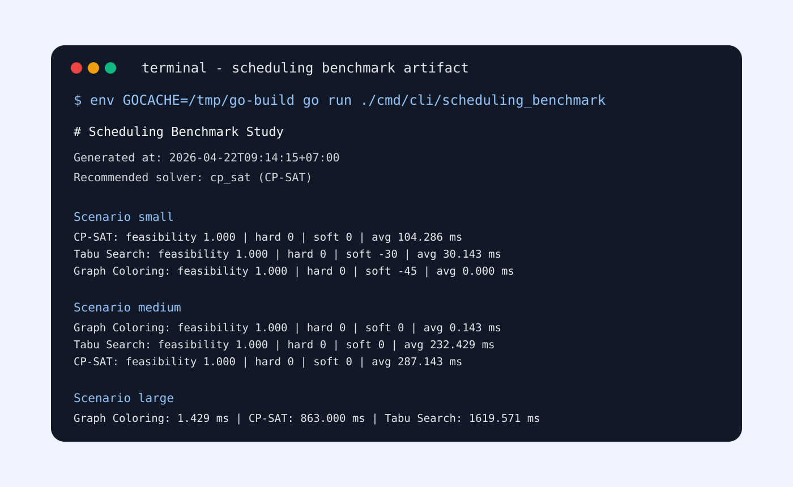

# BÁO CÁO BENCHMARK XẾP LỊCH HỌC TẬP

**Phiên bản báo cáo:** Rerun chính thức ngày `2026-04-22`  
**Artifact benchmark:** `cmd/cli/scheduling_benchmark`  
**Commit dùng để chạy benchmark:** `63c4cfb`  
**Môi trường chạy:** `go1.26.0 darwin/arm64`, `Darwin 23.6.0`, Apple Silicon

---

## Tóm tắt

Báo cáo này trình bày thực nghiệm benchmark cho bài toán xếp lịch học của hệ thống EduCenter. Mục tiêu của benchmark là so sánh ba solver đã được cài đặt trong project gồm `Graph Coloring + Heuristic`, `CP-SAT` và `Tabu Search`, từ đó lựa chọn solver mặc định cho API scheduling production-like.

Thực nghiệm được chạy trên cùng một chuẩn dữ liệu đầu vào, cùng bộ hard constraints, cùng cơ chế sinh slot dựa trên `Shift` và `ClassSchedule`, và cùng logic chấm `soft score`. Ba scenario chuẩn được dùng gồm `small`, `medium`, `large`. Mỗi scenario chạy `7 lần` để đánh giá đồng thời bốn khía cạnh: khả năng tìm nghiệm (`feasibility`), độ sạch hard constraints (`hard violation count`), chất lượng nghiệm (`soft score`) và thời gian xử lý (`runtime`), kèm theo đánh giá độ ổn định (`stability`).

Kết quả thực nghiệm cho thấy cả ba solver đều tạo được nghiệm khả thi và không phát sinh hard violation trên ba scenario chuẩn. `Graph Coloring + Heuristic` có lợi thế rõ rệt về tốc độ, `Tabu Search` đóng vai trò tham chiếu về hướng metaheuristic nhưng không thể hiện ưu thế chất lượng đủ mạnh, còn `CP-SAT` cho tín hiệu tốt nhất về chất lượng nghiệm ở scenario `small` trong khi runtime vẫn còn nằm trong ngưỡng chấp nhận được cho phạm vi đồ án. Vì vậy, `CP-SAT` tiếp tục được lựa chọn làm solver mặc định cho API scheduling chính.

---

## 1. Bối cảnh và mục tiêu nghiên cứu

Trong bài toán vận hành trung tâm dạy thêm, xếp lịch học là nút giao giữa dữ liệu quản trị và dữ liệu vận hành thực tế. Một phương án xếp lịch tốt không chỉ cần hợp lệ về mặt ràng buộc, mà còn phải đủ ổn định để có thể commit sang `lesson` và tiếp tục phục vụ các nghiệp vụ sau buổi học như điểm danh, sổ đầu bài và kết quả học tập.

Từ góc nhìn nghiên cứu kỹ thuật, benchmark scheduling trong đồ án nhằm trả lời ba câu hỏi:

1. Với cùng một chuẩn dữ liệu đầu vào, solver nào luôn tìm được nghiệm khả thi và sạch hard constraints?
2. Khi dữ liệu tăng từ quy mô nhỏ lên quy mô lớn hơn, solver nào giữ được cân bằng tốt hơn giữa chất lượng nghiệm và chi phí runtime?
3. Kết quả benchmark có đủ chắc để biện minh cho việc chọn một solver mặc định cho API production-like hay không?

Mục tiêu của báo cáo không dừng ở việc “chạy thử ba thuật toán”, mà là đưa ra một quyết định lựa chọn solver có căn cứ, có thể truy vết từ dữ liệu đầu vào, môi trường thực nghiệm, cách chấm điểm và kết quả đầu ra.

---

## 2. Phát biểu bài toán

### 2.1 Đầu vào của bài toán

Đầu vào chuẩn của benchmark được chuẩn hóa theo `SolverInput` và bao gồm:

- khoảng ngày chạy preview/benchmark (`date_from`, `date_to`);
- danh sách lớp học đang ở trạng thái `OPEN`;
- giáo viên phụ trách lớp;
- khóa học gắn với lớp, trong đó `session_count` quyết định số buổi cần sinh và `session_duration_minutes` quyết định thời lượng mỗi buổi;
- danh sách phòng học khả dụng;
- danh sách `Shift` đang hoạt động;
- `ClassSchedule` để giới hạn slot theo `day_of_week + shift_id`.

### 2.2 Hard constraints

Benchmark sử dụng cùng bộ hard constraints như scheduling production-like:

- không trùng giáo viên ở cùng thời điểm;
- không trùng phòng học ở cùng thời điểm;
- không trùng lớp ở cùng thời điểm;
- chỉ dùng các `Shift` đang `is_active = true`;
- chỉ dùng slot hợp lệ sinh ra từ `ClassSchedule`;
- chỉ dùng phòng đủ sức chứa cho sĩ số tối đa của lớp;
- không commit được nếu preview còn conflict hoặc còn unscheduled lesson.

### 2.3 Soft constraints

Trong phạm vi đồ án hiện tại, `soft score` đóng vai trò phản ánh mức “thuận tiện vận hành”, gồm các ưu tiên như:

- hạn chế khoảng trống thời gian kém hợp lý giữa các buổi dạy của cùng giáo viên;
- ưu tiên phương án có bố cục slot ổn định hơn;
- chấp nhận một số khác biệt heuristic giữa các solver để so sánh chất lượng nghiệm.

Soft score được dùng để so sánh tương đối giữa các solver trong cùng một bộ dữ liệu, không được dùng để thay thế hard constraints.

---

## 3. Các solver được benchmark

### 3.1 Graph Coloring + Heuristic

**File cài đặt:** [internal/services/scheduling/graph_coloring_solver.go](/Users/hant/golang/doan/internal/services/scheduling/graph_coloring_solver.go)

Đây là baseline heuristic của hệ thống. Ý tưởng trung tâm là xem mỗi `session` cần xếp như một đỉnh trong đồ thị xung đột. Hai đỉnh được nối cạnh nếu chúng không thể xuất hiện cùng lúc, ví dụ cùng giáo viên hoặc cùng lớp. Sau đó solver cố gắng “tô màu” cho các đỉnh, trong đó một “màu” tương đương với một `slot thời gian`, rồi chọn phòng phù hợp cho slot đó.

#### Cách hoạt động theo từng bước

1. Chuẩn hóa bài toán đầu vào thành tập `variables` và `domains`.
2. Dựng đồ thị xung đột giữa các `variables`.
3. Sắp xếp `variables` theo mức độ khó:
   - domain ít hơn được ưu tiên trước;
   - nếu bằng nhau thì đỉnh có nhiều hàng xóm xung đột hơn được ưu tiên trước.
4. Gom domain theo từng `slot`.
5. Tính penalty cho từng `slot` dựa trên:
   - số lần slot đã được dùng;
   - có đụng với hàng xóm đã được gán hay không.
6. Chọn slot có penalty thấp nhất, rồi chọn phòng hợp lệ đầu tiên trong slot đó.
7. Nếu không gán được thì session đó để lại cho bước tổng hợp conflict.

#### Mã giả mô tả

```text
input -> variables, domains, adjacency
sort variables theo (domain_size tăng dần, degree giảm dần)

for mỗi variable trong variables:
    grouped_slots = group domain theo time slot
    sort grouped_slots theo graphSlotPenalty tăng dần

    assigned = false
    for mỗi slot trong grouped_slots:
        for mỗi candidate trong slot:
            nếu candidate không xung đột với assignments hiện tại:
                gán variable -> candidate
                cập nhật slotUsage
                assigned = true
                break
        nếu assigned:
            break

build solver output từ assignments + conflicts còn lại
```

#### Ưu điểm

- Tốc độ rất nhanh.
- Dễ hiểu, dễ cài đặt, phù hợp làm baseline.
- Phù hợp khi cần có nghiệm nhanh để đối chiếu.

#### Hạn chế

- Phụ thuộc mạnh vào heuristic sắp xếp và cách chấm penalty.
- Không khám phá sâu không gian nghiệm.
- Chất lượng nghiệm có thể kém hơn khi có nhiều phương án hợp lệ cùng tồn tại.

### 3.2 CP-SAT

**File cài đặt:** [internal/services/scheduling/cp_sat_solver.go](/Users/hant/golang/doan/internal/services/scheduling/cp_sat_solver.go)

`CP-SAT` trong project hiện được triển khai theo phong cách tìm kiếm ràng buộc có nhánh cận (`branch and bound` nhẹ), lấy cảm hứng từ tư duy constraint programming. Solver không brute force toàn bộ miền giá trị, mà sắp thứ tự biến khó trước, thử các candidate tốt trước, cắt nhánh sớm và luôn giữ lại nghiệm tốt nhất tìm được.

#### Cách hoạt động theo từng bước

1. Chuẩn hóa đầu vào thành `variables`, `domains`, `preset conflicts`.
2. Sắp xếp biến theo nguyên tắc:
   - domain nhỏ hơn đi trước;
   - nếu bằng nhau thì lớp có nhiều session hơn đi trước.
3. Duyệt tìm kiếm theo chiều sâu:
   - thử từng candidate hợp lệ cho biến hiện tại;
   - nếu candidate không xung đột thì tạm gán và đi tiếp.
4. Áp dụng cắt nhánh:
   - nếu số biến còn lại không đủ để vượt nghiệm tốt nhất hiện tại thì dừng nhánh;
   - giới hạn tổng số node thăm (`maxNodes`) để runtime không bùng nổ.
5. Ở lá cây tìm kiếm, đánh giá nghiệm theo:
   - số session đã xếp được;
   - nếu bằng nhau thì so `soft score`.
6. Lưu lại nghiệm tốt nhất toàn cục.
7. Trả về nghiệm tốt nhất sau khi tìm kiếm kết thúc.

#### Mã giả mô tả

```text
bestAssignments = {}
bestAssigned = -1
bestSoftScore = -1

sort variables theo (domain_size tăng dần, session_total giảm dần)

function search(index, assignments):
    nếu vượt maxNodes:
        return

    remaining = totalVariables - index
    nếu len(assignments) + remaining < bestAssigned:
        return

    nếu index == totalVariables:
        cập nhật nghiệm tốt nhất nếu:
            số session đã gán lớn hơn
            hoặc bằng nhau nhưng soft score tốt hơn
        return

    variable = variables[index]
    candidates = sort domain theo thời gian tăng dần

    for candidate in candidates:
        nếu candidate không xung đột:
            gán variable -> candidate
            search(index + 1, assignments)
            bỏ gán

    search(index + 1, assignments)  // cho phép bỏ qua biến nếu cần
```

#### Ưu điểm

- Tìm kiếm có định hướng, chất lượng nghiệm tốt hơn ở case có phân biệt.
- Tận dụng được logic “best solution so far”.
- Phù hợp để làm solver chính vì cân bằng giữa tính đúng và chất lượng nghiệm.

#### Hạn chế

- Runtime tăng rõ khi quy mô lớn hơn heuristic baseline.
- Hiệu năng phụ thuộc vào chiến lược sắp biến và cắt nhánh.
- Vẫn là phiên bản rút gọn phù hợp scope đồ án, chưa phải industrial CP-SAT đầy đủ.

### 3.3 Tabu Search

**File cài đặt:** [internal/services/scheduling/tabu_search_solver.go](/Users/hant/golang/doan/internal/services/scheduling/tabu_search_solver.go)

`Tabu Search` là solver local search/metaheuristic. Thay vì xây nghiệm bằng một lần duyệt greedy rồi dừng, solver này bắt đầu từ một nghiệm khởi tạo, sau đó liên tục thử các bước chuyển (`move`) để cải thiện nghiệm. Một danh sách tabu được dùng để tránh việc thuật toán quay lại các trạng thái vừa đi qua.

#### Cách hoạt động theo từng bước

1. Tạo nghiệm khởi tạo bằng greedy.
2. Tính penalty của nghiệm hiện tại:
   - phạt mạnh nếu còn session chưa xếp;
   - phạt nếu còn xung đột;
   - trừ điểm theo `soft score` để ưu tiên nghiệm tốt hơn.
3. Với mỗi iteration:
   - duyệt một lân cận giới hạn của từng biến;
   - thử chuyển biến sang candidate mới;
   - nếu candidate mới làm phát sinh blocking assignments thì loại bớt các assignment chặn nó.
4. Tính penalty cho nghiệm ứng viên.
5. Nếu move đang tabu nhưng không tốt hơn nghiệm tốt nhất toàn cục thì bỏ qua.
6. Chọn move tốt nhất trong iteration hiện tại.
7. Cập nhật danh sách tabu và nghiệm hiện tại.
8. Nếu nghiệm hiện tại tốt hơn nghiệm tốt nhất thì cập nhật nghiệm tốt nhất.
9. Sau khi hết iteration, chạy bước repair để phục hồi những assignment còn thiếu nếu có thể.

#### Mã giả mô tả

```text
current = greedy_initial_solution()
best = current
tabu = {}

for iteration in 1..maxIterations:
    bestMove = none

    for variable in variables:
        for candidate in limitedNeighborhood(domain[variable]):
            candidateAssignments = clone(current)
            loại bỏ các assignment đang chặn candidate
            gán variable -> candidate

            penalty = evaluate(candidateAssignments)
            moveKey = formatMove(variable, candidate)

            nếu move tabu và penalty không tốt hơn best:
                continue

            nếu bestMove chưa có hoặc penalty tốt hơn:
                bestMove = candidateAssignments

    nếu không có bestMove:
        break

    current = bestMove
    đánh dấu move vào tabu list

    nếu current tốt hơn best:
        best = current

best = repairAssignments(best)
return best
```

#### Ưu điểm

- Có khả năng khám phá không gian nghiệm rộng hơn greedy đơn giản.
- Có tính học thuật tốt khi so sánh với nhánh heuristic và constraint search.
- Cơ chế tabu giúp tránh lặp lại các bước chuyển gần nhau.

#### Hạn chế

- Runtime cao hơn đáng kể ở scenario lớn.
- Hiệu quả nhạy với nghiệm khởi tạo, kích thước tabu tenure và số iteration.
- Trong benchmark hiện tại chưa tạo ra lợi thế đủ mạnh để vượt `CP-SAT`.

---

## 4. Thiết kế thực nghiệm

### 4.1 Bộ dữ liệu benchmark

Ba scenario chuẩn được định nghĩa trong [internal/services/scheduling/benchmark_study.go](/Users/hant/golang/doan/internal/services/scheduling/benchmark_study.go).


**Hình 1.** Tổng quan ba scenario benchmark dùng trong thực nghiệm scheduling.

| Scenario | Số lớp | Số giáo viên | Số phòng | Số ca | Số session yêu cầu | Số lần chạy |
| --- | ---: | ---: | ---: | ---: | ---: | ---: |
| `small` | 6 | 4 | 3 | 3 | 12 | 7 |
| `medium` | 10 | 5 | 4 | 3 | 30 | 7 |
| `large` | 16 | 7 | 5 | 3 | 64 | 7 |

Các scenario đều có đặc điểm:

- dùng dữ liệu tổng hợp nhưng deterministic;
- tái sử dụng giáo viên có kiểm soát để tạo áp lực xung đột;
- có lớp bị khóa `preferred_room` theo chu kỳ để ép solver xử lý ràng buộc tài nguyên;
- dùng `Shift` sáng/chiều/tối và `ClassSchedule` thật để slot được sinh ra giống logic production-like.

### 4.2 Tiêu chí đánh giá

Benchmark dùng 5 chỉ số chính:

1. `Feasibility rate`: tỷ lệ số session được xếp thành công trên tổng session yêu cầu.
2. `Hard violation count`: số conflict còn lại sau khi solver hoàn tất.
3. `Soft score`: điểm chất lượng nghiệm do hệ thống chấm.
4. `Runtime (ms)`: thời gian chạy solver.
5. `Stability`: độ ổn định giữa nhiều lần chạy, đo bằng signature của output.

### 4.3 Cách đo số liệu

Trong mỗi scenario:

1. Dùng cùng một `SolverInput` cho cả ba solver.
2. Chạy mỗi solver `7 lần`.
3. Với mỗi lần chạy, ghi lại:
   - `status`
   - `scheduled_lessons`
   - `unscheduled_lessons`
   - `conflict_count`
   - `soft_score`
   - `runtime_ms`
4. Tính các giá trị tổng hợp:
   - trung bình feasibility
   - trung bình hard violations
   - trung bình soft score
   - runtime trung bình
   - runtime min/max
5. So sánh signature giữa các lần chạy để xác định `StableAcrossRuns`.

### 4.4 Lệnh chạy chuẩn

```bash
env GOCACHE=/tmp/go-build go run ./cmd/cli/scheduling_benchmark
```

### 4.5 Minh chứng artifact benchmark



**Hình 2.** Artifact CLI dùng để tái tạo benchmark scheduling trong repo.

---

## 5. Kết quả thực nghiệm

### 5.1 Bảng tổng hợp toàn bộ số liệu đã đo

| Scenario | Solver | Feasibility | Hard violations | Soft score | Avg runtime (ms) | Range (ms) | Stable |
| --- | --- | ---: | ---: | ---: | ---: | --- | --- |
| `small` | CP-SAT | 1.000 | 0.000 | 0.000 | 104.286 | 98-124 | true |
| `small` | Tabu Search | 1.000 | 0.000 | -30.000 | 30.143 | 28-32 | true |
| `small` | Graph Coloring + Heuristic | 1.000 | 0.000 | -45.000 | 0.000 | 0-0 | true |
| `medium` | Graph Coloring + Heuristic | 1.000 | 0.000 | 0.000 | 0.143 | 0-1 | true |
| `medium` | Tabu Search | 1.000 | 0.000 | 0.000 | 232.429 | 219-256 | true |
| `medium` | CP-SAT | 1.000 | 0.000 | 0.000 | 287.143 | 273-325 | true |
| `large` | Graph Coloring + Heuristic | 1.000 | 0.000 | 0.000 | 1.429 | 1-2 | true |
| `large` | CP-SAT | 1.000 | 0.000 | 0.000 | 863.000 | 820-954 | true |
| `large` | Tabu Search | 1.000 | 0.000 | 0.000 | 1619.571 | 1591-1671 | true |

### 5.2 Scenario `small`

| Solver | Avg feasibility | Avg hard violations | Avg soft score | Avg runtime (ms) | Runtime range (ms) | Stable | Status |
| --- | ---: | ---: | ---: | ---: | --- | --- | --- |
| CP-SAT | 1.000 | 0.000 | 0.000 | 104.286 | 98-124 | true | COMPLETED |
| Tabu Search | 1.000 | 0.000 | -30.000 | 30.143 | 28-32 | true | COMPLETED |
| Graph Coloring + Heuristic | 1.000 | 0.000 | -45.000 | 0.000 | 0-0 | true | COMPLETED |

Nhận xét nhanh:

- Cả ba solver đều xếp được đủ 12/12 session.
- Chỉ số tạo khác biệt ở scenario này là `soft score`.
- `CP-SAT` cho chất lượng nghiệm tốt nhất trong khi runtime vẫn đủ thấp để chấp nhận.

### 5.3 Scenario `medium`

| Solver | Avg feasibility | Avg hard violations | Avg soft score | Avg runtime (ms) | Runtime range (ms) | Stable | Status |
| --- | ---: | ---: | ---: | ---: | --- | --- | --- |
| Graph Coloring + Heuristic | 1.000 | 0.000 | 0.000 | 0.143 | 0-1 | true | COMPLETED |
| Tabu Search | 1.000 | 0.000 | 0.000 | 232.429 | 219-256 | true | COMPLETED |
| CP-SAT | 1.000 | 0.000 | 0.000 | 287.143 | 273-325 | true | COMPLETED |

Nhận xét nhanh:

- Chất lượng nghiệm giữa ba solver không còn khác biệt theo `soft score`.
- `Graph Coloring` rất nhanh, nhưng đây mới là lợi thế runtime, chưa đủ để thay thế `CP-SAT`.
- `CP-SAT` chậm hơn nhưng vẫn nằm trong vùng runtime hoàn toàn khả thi cho benchmark nội bộ và demo đồ án.

### 5.4 Scenario `large`

| Solver | Avg feasibility | Avg hard violations | Avg soft score | Avg runtime (ms) | Runtime range (ms) | Stable | Status |
| --- | ---: | ---: | ---: | ---: | --- | --- | --- |
| Graph Coloring + Heuristic | 1.000 | 0.000 | 0.000 | 1.429 | 1-2 | true | COMPLETED |
| CP-SAT | 1.000 | 0.000 | 0.000 | 863.000 | 820-954 | true | COMPLETED |
| Tabu Search | 1.000 | 0.000 | 0.000 | 1619.571 | 1591-1671 | true | COMPLETED |

Nhận xét nhanh:

- Khi quy mô tăng lên, sự khác biệt runtime trở nên rõ nhất.
- `CP-SAT` vẫn giữ được trạng thái `COMPLETED`, feasibility tuyệt đối và không phát sinh hard violation.
- `Tabu Search` là solver chậm nhất ở scenario lớn.

### 5.5 So sánh trực quan runtime


**Hình 3.** So sánh runtime trung bình giữa ba solver trên ba scenario.

### 5.6 So sánh trực quan soft-constraint penalty ở scenario `small`


**Hình 4.** So sánh độ phạt soft constraint ở scenario `small` (càng thấp càng tốt).

---

## 6. Phân tích và thảo luận

### 6.1 Về khả năng tìm nghiệm

Ở cả ba scenario, mọi solver đều đạt `feasibility = 1.000`. Điều này cho thấy:

- bộ dữ liệu benchmark đã được thiết kế hợp lệ;
- abstraction `SchedulingSolver` đủ nhất quán để so sánh công bằng;
- logic sinh slot dựa trên `Shift` và `ClassSchedule` không làm lệch kết quả giữa các solver.

### 6.2 Về hard constraints

Không solver nào để lại hard violation. Đây là điều kiện tiên quyết cho việc dùng benchmark để chọn solver chính, vì với scheduling production-like, một nghiệm “đẹp” nhưng bẩn hard constraint là vô nghĩa.

### 6.3 Về chất lượng nghiệm

Scenario `small` là nơi benchmark bắt đầu thể hiện khác biệt:

- `CP-SAT` có `soft score = 0`, tốt nhất trong ba solver;
- `Tabu Search` kém hơn với `-30`;
- `Graph Coloring + Heuristic` thấp nhất với `-45`.

Điều này đặc biệt quan trọng vì khi các solver đều thỏa hard constraints, quyết định lựa chọn không thể chỉ nhìn vào tính đúng, mà phải dựa thêm vào chất lượng nghiệm.

### 6.4 Về runtime

Kết quả runtime khẳng định một quy luật khá rõ:

- `Graph Coloring + Heuristic` luôn nhanh nhất;
- `CP-SAT` có runtime cao hơn nhưng vẫn trong ngưỡng dùng được cho phạm vi đồ án;
- `Tabu Search` chậm nhất ở scenario `large`, trong khi không tạo ra lợi thế rõ về soft score.

Từ góc nhìn vận hành hệ thống, runtime của `CP-SAT` ở scenario `large` vẫn phù hợp cho:

- chạy preview nội bộ;
- benchmark để làm báo cáo;
- demo trong buổi bảo vệ.

### 6.5 Về stability

Cả ba solver đều ổn định trong `7 lần chạy` của từng scenario:

- `Stable = true` ở toàn bộ các tổ hợp scenario-solver;
- signature của output không đổi theo `status`, `scheduled`, `unscheduled`, `conflict`, `soft score`.

Điều này củng cố tính lặp lại của benchmark và làm cho kết luận lựa chọn solver có giá trị hơn về mặt nghiên cứu.

### 6.6 Hạn chế của benchmark hiện tại

Benchmark hiện tại vẫn có một số giới hạn:

- dữ liệu benchmark là dữ liệu tổng hợp, chưa phải log vận hành thật từ DB production-like;
- `soft score` hiện còn tương đối gọn, chưa phản ánh đầy đủ mọi ưu tiên sư phạm;
- benchmark chưa đánh giá chi phí commit sau preview trong điều kiện tải thực tế nhiều người dùng.

Những hạn chế này không phủ nhận giá trị của benchmark, nhưng cần được ghi nhận trung thực trong báo cáo.

### 6.7 So sánh ưu nhược điểm của ba thuật toán

| Thuật toán | Điểm mạnh chính | Điểm yếu chính | Vai trò trong đồ án |
| --- | --- | --- | --- |
| Graph Coloring + Heuristic | Rất nhanh, dễ hiểu, baseline tốt | Chất lượng nghiệm phụ thuộc heuristic | Baseline runtime và thuật toán đối chứng đơn giản |
| CP-SAT | Cân bằng tốt giữa tính đúng và chất lượng nghiệm | Chậm hơn heuristic baseline | Solver chính cho preview production-like |
| Tabu Search | Có chiều sâu học thuật, khám phá local search | Runtime cao, chưa thắng rõ về chất lượng | Thuật toán đối chứng metaheuristic |

---

## 7. Quyết định lựa chọn solver chính

### 7.1 Kết luận lựa chọn

**Solver được chọn cho API scheduling production-like:** `CP-SAT`

### 7.2 Lý do lựa chọn

1. `CP-SAT` đạt cùng mức feasibility tuyệt đối và không phát sinh hard violation như các solver còn lại.
2. `CP-SAT` cho tín hiệu tốt nhất về chất lượng nghiệm ở scenario `small`, là nơi benchmark thể hiện được khác biệt thực sự.
3. Runtime của `CP-SAT` chậm hơn heuristic baseline, nhưng vẫn đủ tốt cho phạm vi vận hành và bảo vệ đồ án.
4. `Tabu Search` không tạo ra lợi thế chất lượng đủ mạnh để bù lại chi phí runtime cao hơn.
5. Quyết định này phù hợp với mục tiêu của đồ án: ưu tiên nghiệm sạch, chất lượng đủ tốt và có cơ sở benchmark rõ ràng.

### 7.3 Lý do không chọn hai thuật toán còn lại

**Không chọn Graph Coloring + Heuristic làm solver chính** vì:

- tuy nhanh nhất nhưng soft score kém hơn rõ ở scenario `small`;
- đây là thuật toán dễ bị phụ thuộc vào heuristic cục bộ;
- phù hợp làm baseline hơn là làm lựa chọn production-like chính.

**Không chọn Tabu Search làm solver chính** vì:

- runtime ở `large` cao nhất trong ba solver;
- không tạo ra lợi thế soft score để biện minh cho chi phí runtime;
- phù hợp hơn với vai trò đối chứng học thuật.

### 7.4 Vai trò của hai solver còn lại

- `Graph Coloring + Heuristic`: giữ làm baseline benchmark và làm đối chứng runtime.
- `Tabu Search`: giữ làm đối chứng metaheuristic để tăng chiều sâu học thuật cho báo cáo.

---

## 8. Tái lập thực nghiệm và đối chiếu artifact

### 8.1 Cách chạy lại benchmark

```bash
env GOCACHE=/tmp/go-build go run ./cmd/cli/scheduling_benchmark
```

### 8.2 Các artifact liên quan

- Benchmark service: [internal/services/scheduling/benchmark_study.go](/Users/hant/golang/doan/internal/services/scheduling/benchmark_study.go)
- Benchmark CLI: [cmd/cli/scheduling_benchmark/main.go](/Users/hant/golang/doan/cmd/cli/scheduling_benchmark/main.go)
- Benchmark admin API: [cmd/http/controllers/scheduling/v1.go](/Users/hant/golang/doan/cmd/http/controllers/scheduling/v1.go)
- Benchmark use case: [internal/usecases/scheduling/benchmark.go](/Users/hant/golang/doan/internal/usecases/scheduling/benchmark.go)
- H1 test matrix:
  - [internal/services/scheduling/benchmark_study_test.go](/Users/hant/golang/doan/internal/services/scheduling/benchmark_study_test.go)
  - [internal/usecases/scheduling/preview_commit_test.go](/Users/hant/golang/doan/internal/usecases/scheduling/preview_commit_test.go)
  - [cmd/http/controllers/scheduling/v1_test.go](/Users/hant/golang/doan/cmd/http/controllers/scheduling/v1_test.go)

### 8.3 Danh sách hình minh chứng đi kèm

1. Hình 1: Tổng quan ba scenario benchmark.
2. Hình 2: Artifact CLI benchmark dùng để tái tạo thực nghiệm.
3. Hình 3: Biểu đồ runtime trung bình.
4. Hình 4: Biểu đồ độ phạt soft constraint ở scenario `small`.

---

## 9. Kết luận

Benchmark scheduling của EduCenter đã đạt được mục tiêu nghiên cứu đặt ra trong giai đoạn hiện tại:

- có cùng chuẩn đầu vào cho nhiều solver;
- có chỉ số đánh giá rõ ràng;
- có dữ liệu small/medium/large;
- có kiểm tra stability bằng nhiều lần chạy;
- có artifact CLI và test matrix đủ để tái lập;
- có căn cứ rõ ràng để chọn `CP-SAT` làm solver chính.

Với kết quả này, phần scheduling của đồ án không còn dừng ở mức “có thuật toán”, mà đã tiến gần hơn tới một bài toán tối ưu hóa có benchmark, có thực nghiệm và có lập luận lựa chọn rõ ràng.
